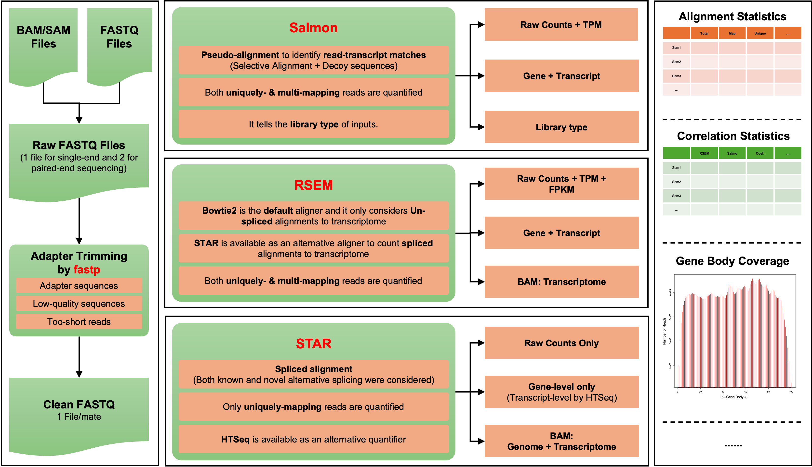

# Bulk RNA-seq Quantification Pipeline 2025

## Overview

This pipeline is developed to quantify the abundance of genes and transcripts from bulk RNA-seq data. It contains three sections:

- Prepprocessing: 

This pipeline is designed to accurately quantify gene and transcript abundance from bulk RNA-seq data. By integrating both alignment-free and alignment-based methods, it enables cross-validation to ensure robust and reliable quantification results.

As illustrated above, the pipeline consists of three stages:

#### 1. Preprocessing ####

The pipeline accepts raw input files in variable formats (e.g., FASTQ, BAM/SAM) and processes them to generate **standard-in-format**, **clean-in-sequence** FASTQ files. These cleaned files are optimized for downstream quantification analysis.

#### 2. Quantification

In this stage, the pipeline quantifies the abundance of both genes and transcripts. It supports three well-established and widely-used quantifiers:

- [**Salmon**](https://salmon.readthedocs.io/en/latest/salmon.html): An **alignment-free quantifier** known for its **wicked-fast speed** and **comarable accuracy**.

- [**RSEM**](https://github.com/bli25/RSEM_tutorial): An **alignment-based quantifier** with **exceptional accuracy**. It has been used as **gold standard** in many benchmarking studies.

- [**STAR**](https://github.com/alexdobin/STAR/blob/master/doc/STARmanual.pdf): An **alignment-based quantifier** featured by **splice-aware alignment**. This is the tool used by [GDC mRNA quantification analysis pipeline](https://docs.gdc.cancer.gov/Data/Bioinformatics_Pipelines/Expression_mRNA_Pipeline).

#### 3. Summarization

The pipeline generates a comprehensive **HTML report** for each sample, detailing quantification results, alignment statistics, correlation analyses, gene body coverage visualizations, and more. For multiple samples, it produces **a unified summary report** and a master gene expression matrix, which can be directly utilized for downstream analyses such as [**NetBID**](https://github.com/jyyulab/NetBID).

## Tutorial

A detailed tutorial to ***set up*** and ***run*** this pipeline can be found here: https://jyyulab.github.io/bulkRNAseq_quantification_pipeline/.
