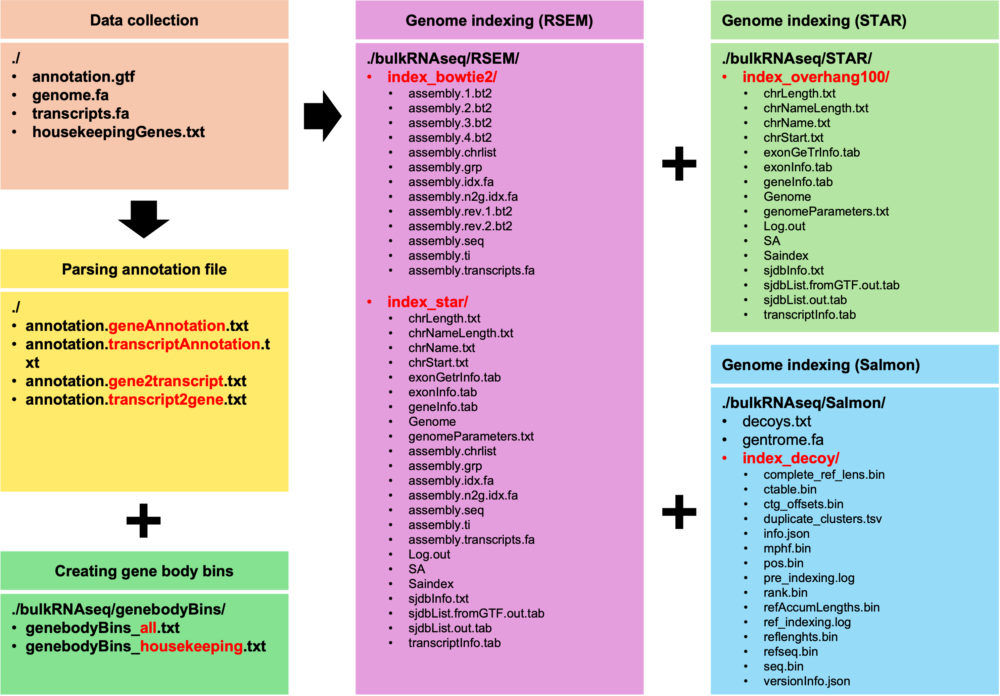

## Part II: Database Preparation

In addition to installiing the necessary tools and dependencies, you will also need to prepare **reference genome databases** for use in alignment, quantification and QC assessment.

For this pipeline, each reference genome assembly has its own dedicated database folder. Below is an overview of the database preparation process and key inputs and outputs of each step:



Below, we will use the hg38 as a example to go through this process step-by-step. To start, locate yourself to the folder of your conda enviorment:

``` bash
# locate to your conda env, change the path accordingly
cd /research_jude/rgs01_jude/groups/yu3grp/projects/software_JY/yu3grp/conda_env/bulkRNAseq_2025
```

1. **Data collection**

   There are **FOUR** files required for database preparation. Three of them can be directly downloaded from online resources:

   - ***<u>annotation.gtf</u>***: Gene Annotation file in [GTF](https://biocorecrg.github.io/PhD_course_genomics_format_2021/gtf_format.html) (Gene Transfer Format) format. 

   - ***<u>transcriptome.fa</u>***: Transcriptome sequence file in [FASTA](https://www.ncbi.nlm.nih.gov/genbank/fastaformat/) format

   - ***<u>genome.fa</u>***: Genome sequence file in [FASTA](https://www.ncbi.nlm.nih.gov/genbank/fastaformat/) format

     ```bash
     # create and change to the database folder
     mkdir -p pipeline/databases/hg38/gencode.release48 # for annotation release 48 for hg38
     cd pipeline/databases/hg38/gencode.release48
     
     # download the three files from https://www.gencodegenes.org/human/release_48.html
     wget https://ftp.ebi.ac.uk/pub/databases/gencode/Gencode_human/release_48/gencode.v48.primary_assembly.annotation.gtf.gz
     wget https://ftp.ebi.ac.uk/pub/databases/gencode/Gencode_human/release_48/gencode.v48.transcripts.fa.gz
     wget https://ftp.ebi.ac.uk/pub/databases/gencode/Gencode_human/release_48/GRCh38.primary_assembly.genome.fa.gz
     
     # decompress them
     gunzip *
     
     # rename them
     mv gencode.v48.primary_assembly.annotation.gtf annotation.gtf
     mv gencode.v48.transcripts.fa.gz transcripts.fa
     mv GRCh38.primary_assembly.genome.fa.gz genome.fa
     ```

     ***<u>NOTE:</u>*** For the three files listed above,  we recommend downloading them from [GENCODE](https://www.gencodegenes.org/) for human and mouse. For other species, we suggest using [Ensembl](https://useast.ensembl.org/info/data/ftp/index.html). 

   - ***<u>HouseKeeping gene list</u>***: the housekeeping genes defined by [this study](https://www.sciencedirect.com/science/article/pii/S0168952513000899?via%3Dihub) (N = 3804).

     ***<u>NOTE:</u>*** For human, the list of housekeeping genes can be downloaded [here](https://github.com/jyyulab/bulkRNAseq_quantification_pipeline/blob/main/databases/housekeepingGenes_human.txt). For other species, you can generate the housekeeping gene list by gene homology conversion using BiomaRt or other tools. Below is the codes we used to generate the housekeeping genes for mouse (avaibale [here](https://github.com/jyyulab/bulkRNAseq_quantification_pipeline/blob/main/databases/housekeepingGenes_mouse.txt)):

     ``` R
     library(NetBID2)
     
     HK_hg <- read.table("housekeepingGenes_human.txt")
     HK_mm <- get_IDtransfer_betweenSpecies(
       from_spe = "human", to_spe = "mouse", from_type = "hgnc_symbol", to_type = "mgi_symbol",
       use_genes = unique(HK_hg$V1));
     colnames(HK_mm) <- paste0("#", colnames(HK_mm))
     write.table(HK_mm[,c(2,1)], ## Please make sure the mouse gene symbols are in the FIRST column
                 file = "housekeepingGenes_mouse.txt", col.names = T, row.names = F, sep = "\t", quote = F)
     ```


2. **Parsing annotation file**

   In this step, we will parse the gene annotation file to generate four files required for downstream analysis:

   - **`annotation.gene2transcript.txt`** & **`annotation.transcript2gene.txt`**: These files provide mappings between transcripts and genes, which are necessary for gene-level quantification.
   - **`annotation.geneAnnotation.txt`** & **`annotation.transcriptAnnotation.txt`**: These files contain detailed annotations for genes and transcripts, and are used in generating the final gene expression matrix.

   To simplify this process, we have provided a script, [**`parseAnnotation.pl`**](https://github.com/jyyulab/bulkRNAseq_quantification_pipeline/blob/main/scripts/setup/parseAnnotation.pl), which allows you to easily generate all four filest:

   ``` bash
   ## parse the gene anotation file
   ## This command will generate four files in the same folder as annotation.gtf.
   ## Only ONE argument is need: gene annotation file in GTF format.
   perl /research_jude/rgs01_jude/groups/yu3grp/projects/software_JY/yu3grp/conda_env/bulkRNAseq_2025/pipeline/scripts/setup/parseAnnotation.pl annotation.gtf
   ```

3. **Creating gene body bins**

   In this step, we will create a bin list for the longest transcript of each gene, with 100 bins per transcript by default. This list is required for gene body coverage analysis - **a key quality control metric that indicates the extent of RNA degradation**.

   

   Two files will be generated:

   - ***<u>./bulkRNAseq/genebodyBins/genebodyBins_all.txt</u>***: This file contains bins of the longest transcripts of ***all genes*** (N = 46,402 for human). This approach provides the most comprehensive gene body coverage assessment but is computationally slower.

   - ***<u>./bulkRNAseq/genebodyBins/genebodyBins_housekeeping.txt</u>***: It contains bins of the longest transcripts of ***pre-curated housekeeping genes*** (N = 3,515 for human). Based on our tests across 30+ datasets, gene body coverage statistics from this file are comparable to those from the all-genes version, but it is significantly faster. This method is widely used in many pipelines, including the [RseQC](https://rseqc.sourceforge.net/#genebody-coverage-py). ***<u>Therefore, we set this as the default option in our pipeline</u>***.

   We have also provided a script, [**`createBins.pl`**](https://github.com/jyyulab/bulkRNAseq_quantification_pipeline/blob/main/scripts/setup/createBins.pl), to generate these two files:

   ``` bash
   ## create the gene body bins
   ## This command will generate the two files containing the bin list of the longest transcript of all genes and housekeeping genes.
   ## Three arguments are needed: 1) transcriptome sequence file in FASTA format; 2) a txt file containiing housekeeping genes in the first column; and 3) a directory to save the output files.
   perl /research_jude/rgs01_jude/groups/yu3grp/projects/software_JY/yu3grp/conda_env/bulkRNAseq_2025/pipeline/scripts/setup/createBins.pl transcripts.fa housekeepingGenes_human.txt ./bulkRNAseq/genebodyBins
   ```

4. **Create genome index files for RSEM**

   The following command for building references is adapted from [RSEM's tutorial](https://github.com/bli25/RSEM_tutorial?tab=readme-ov-file#-build-references):

   ``` bash
   #BSUB -P buildIndex
   #BSUB -n 8
   #BSUB -M 8000
   #BSUB -oo index_rsem.out -eo index_rsem.err
   #BSUB -J buildIndex
   #BSUB -q standard
   
   # Path to the bin/ of your conda environment
   dir_bin=/research_jude/rgs01_jude/groups/yu3grp/projects/software_JY/yu3grp/conda_env/bulkRNAseq_2025/bin 
   # Path to the database folder (the directory containing the four files collected in step #1)
   dir_database=/research_jude/rgs01_jude/groups/yu3grp/projects/software_JY/yu3grp/conda_env/bulkRNAseq_2025/pipeline/databases/hg38/gencode.release48
   
   ## RSEM_Bowtie2
   mkdir $dir_database/bulkRNAseq/RSEM/index_bowtie2
   $dir_bin/rsem-prepare-reference --gtf $dir_database/annotation.gtf \
       --bowtie2 --bowtie2-path $dir_bin \
       --num-threads 8 \
       $dir_database/genome.fa \
       $dir_database/bulkRNAseq/RSEM/index_bowtie2/assembly
   
   ## RSEM_STAR
   mkdir $dir_database/bulkRNAseq/RSEM/index_star
   $dir_bin/rsem-prepare-reference --gtf $dir_database/annotation.gtf \
       --star --star-path $dir_bin \
       --num-threads 8 --star-sjdboverhang 100 \
       $dir_database/genome.fa \
       $dir_database/bulkRNAseq/RSEM/index_star/assembly
   ```

5. **Create genome index files for Salmon**

   The command below to build references for Salmon is from [this tutorial](https://combine-lab.github.io/alevin-tutorial/2019/selective-alignment/):

   ``` bash
   #BSUB -P salmonIndex
   #BSUB -n 8
   #BSUB -M 8000
   #BSUB -oo index_salmon.out -eo index_salmon.err
   #BSUB -J buildIndex
   #BSUB -q standard
   
   # Path to the bin/ of your conda environment
   dir_bin=/research_jude/rgs01_jude/groups/yu3grp/projects/software_JY/yu3grp/conda_env/bulkRNAseq_2025/bin 
   # Path to the database folder (the directory containing the four files collected in step #1)
   dir_database=/research_jude/rgs01_jude/groups/yu3grp/projects/software_JY/yu3grp/conda_env/bulkRNAseq_2025/pipeline/databases/hg38/gencode.release48
   
   ## generate a decoy-aware transcriptome (https://combine-lab.github.io/alevin-tutorial/2019/selective-alignment/)
   # collect the names of genome targets
   grep "^>" $dir_database/genome.fa | cut -d " " -f 1 | cut -d ">" -f 2 > $dir_database/bulkRNAseq/Salmon/decoys.txt
   
   # concatenate transcriptome and genome reference files for index
   cat $dir_database/transcripts.fa $dir_database/genome.fa > $dir_database/bulkRNAseq/Salmon/gentrome.fa
   
   # Salmon indexing
   $dir_bin/salmon index -t $dir_database/bulkRNAseq/Salmon/gentrome.fa -d $dir_database/bulkRNAseq/Salmon/decoys.txt -p 8 -i index_decoy --gencode -k 31
   ```

6. **Create genome index files for STAR**

   The command below to build references for STAR is from [its manual](https://physiology.med.cornell.edu/faculty/skrabanek/lab/angsd/lecture_notes/STARmanual.pdf#page=5.42):

   ``` bash
   #BSUB -P STAR_Index
   #BSUB -n 8
   #BSUB -M 8000
   #BSUB -oo index_star.out -eo index_star.err
   #BSUB -J buildIndex
   #BSUB -q standard
   
   # Path to the bin/ of your conda environment
   dir_bin=/research_jude/rgs01_jude/groups/yu3grp/projects/software_JY/yu3grp/conda_env/bulkRNAseq_2025/bin 
   # Path to the database folder (the directory containing the four files collected in step #1)
   dir_database=/research_jude/rgs01_jude/groups/yu3grp/projects/software_JY/yu3grp/conda_env/bulkRNAseq_2025/pipeline/databases/hg38/gencode.release48
   
   # STAR indexing
   $dir_bin/STAR --runThreadN 8 \
       --runMode genomeGenerate \
       --genomeDir $dir_database/bulkRNAseq/STAR/index_overhang100 \
       --genomeFastaFiles $dir_database/genome.fa \
       --sjdbGTFfile $dir_database/annotation.gtf \
       --sjdbOverhang 100
   ```

   
