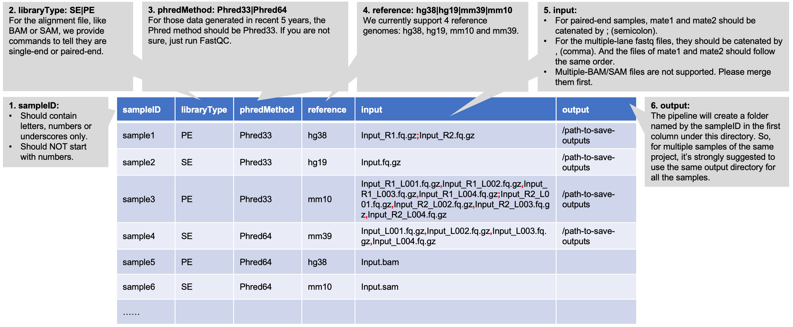

### A quick tutorial to run this pipeline

---

Welcome to the **quick tutorial** of bulk RNA-Seq quantification pipeline! This tutorial aims to provide **immediate and practical guidance** on running this pipeline with your own data. As a quick tutorial, this is mainly for the users who are familar with the basic concepts and tools of RNA-Seq quantification analysis. If you are new to this field, we highly recommend you to start from the **Full Tutorial** that provides more detailed documentation of this pipeline.

To get started, please run the command below to activate the conda environment for this pipeline:

``` bash
module load conda3/202402
conda activate /research_jude/rgs01_jude/groups/yu3grp/projects/software_JY/yu3grp/conda_env/bulkRNAseq_2025
```

If you have your own conda environment, change the commands accordingly. To set up a conda environment for this pipeline, pelase refer to [Pipeline Setup](https://jyyulab.github.io/bulkRNAseq_quantification_pipeline/docs/pipeline_setup/index) tutorial.

#### I. Prepare the sample table

Below is an example of the sample table for this pipeline:



  It is a **tab-delimited text file with 6 columns**:

1) **<u>sampleID</u>**: name of samples. Some rules apply:
   - Should contain **letters**, **numbers** or **underscores** only
   - Should NOT **start with numbers**

2. **<u>libraryType</u>**: type of libraries, `[PE | SE]`. 

   - My input files are in BAM/SAM format, and I'm not sure about the library type of them? The command below can tell that:

     ``` bash
     ## To tell the BAM/SAM files are single- or paired-end
     samtools view -c -f 1 input.bam
     # This command counts the matching records in the bam/sam file.
     # It returns 0 for single-end sequeing. Otherwise, the input bam/sam file is paired-end.
     ```

3. **<u>phredMethod</u>**: Phred quality score encoding method, `[Phred33 | Phred64]`. Not sure about the answer? These two rules can help tell that:

   - Phred64 was retired in late 2011. Data genrated after that should be in Phred33.

   - Use the FastQC to tell that: 

     ``` bash
     ## To tell the Phred quality score encoding method in FASTQ/BAM/SAM files
     fastqc input.fq.gz # for FASTQ files
     fastqc input.bam # for BAM/SAM files
     # This command generates a html report. In the "Basic Statistics" section, there is a measure called "Endcoding":
     # "Sanger / Illumina 1.9" indicates Phred33, while "Illumina 1.5 or lower" indicates Phred64.
     ```

4. **<u>reference</u>**: reference genome assembly, `[hg38 | hg19 | mm39 | mm10]`. 

   - We recommend to use `hg38` for human samples, and `mm39` for mouse samples. The assembly, `hg19` and `mm10`, are mainly used to match some legacy data.
   - For other species or genome assembly, you will need to manually create the required reference files following [this tutorial](https://jyyulab.github.io/bulkRNAseq_quantification_pipeline/docs/pipeline_setup/reference.html).

5. **<u>input</u>**: input files for quantification. This pipeline accepts:

   - **<u>Standard FASTQ files</u>**: both paired-end (sample1) and single-end (sample2). Filenames should be ended with **`.fq`**, **`.fastq`**, **`.fq.gz`** or **`.fastq.gz`**.

   - **<u>FASTQ files of multple lanes</u>**: both paired-end (sample3) and single-end (sample4). Filenames should be ended with **`.bam`** or **`.sam`**.

   - **<u>BAM/SAM files</u>**: single file only (sample 5 and sample6). For samples with  multiple BAM/SAM files (usually splited ones), please merge them first:

     ``` bash
     samtools merge -o output.bam input_1.bam input_2.bam ...
     ```

6. **<u>output</u>**: path to save the output files. This pipeline will create a folder named by the `sampleID` under this directory.


Below are the two ways we recommend to generate the sample table:

* Any coding language you prefer, e.g. BASH, R, Python, Perl *et. al.*
* Excel or VIM. And for you convince, we have a templete avaible on HPC: `/research_jude/rgs01_jude/groups/yu3grp/projects/software_JY/yu3grp/conda_env/bulkRNAseq_2025/git_repo/testdata/sampleTable.testdata.txt`. You can simply copy it to your folder and edit it in VIM. (To insert TAB in VIM: on INSERT mode press control + v + TAB)


### II. Data preprocessing

The purpose of data preprocessing is to prepare the FASTQ files that can be directly used for down-stream quantification analysis. It contains two steps:

- **Data format standardization**: it converts the input files that might be in various formats (FASTQ, BAM, SAM) into the standard FASTQ format. 

- **Adapter trimming**: it removes the adapeter and/or low-quality senquences from the reads.

  

#### 1. Data format standardization

To standardize the data format, you can run the command below:

``` bash
## 1. data format standardization
/research_jude/rgs01_jude/groups/yu3grp/projects/software_JY/yu3grp/conda_env/bulkRNAseq_2025/git_repo/scripts/run/all2Fastq.pl sampleTable.txt
```

This command will:

- Create a folder, **`sampleID/preProcessing`**, in the output directory specified by the `output` column of sampleTable.txt.
- Generate the **`sampleID/preProcessing/all2Fastq.sh`** file and submit it to the HPC queue.

Typically, this step takes **5-10 mins** to complete (for 150M PE-100 reads). The stardard outputs are:

- For PE library type: two paired FASTQ files, **`sampleID/preProcessing/fqRaw_R1.fq.gz`** and **`sampleID/preProcessing/fqRaw_R1.fq.gz`**
- For SE library type: one single FASTQ file, **`sampleID/preProcessing/fqRaw.fq.gz`**


#### 2. Adapter trimming

You can perform the adapter trimming analysis by:

``` bash
## 2. adapter trimming
/research_jude/rgs01_jude/groups/yu3grp/projects/software_JY/yu3grp/conda_env/bulkRNAseq_2025/git_repo/scripts/run/adapterTrimming.pl sampleTable.txt
```

This command will:

- Generate the **`sampleID/preProcessing/adapterTrimming.sh`** file and submit it to the HPC queue.

Typically, this step takes **~5 mins** to complete (for 150M PE-100 reads). The stardard outputs are:

- adapter trimming reports in differnt formats: **`sampleID/preProcessing/adapterTrimming.html`** and **`sampleID/preProcessing/adapterTrimming.json`**
- standard FASTQ files with clean/filtered sequences:
  - For PE library type: two paired FASTQ files, **`sampleID/preProcessing/fqClean_R1.fq.gz`** and **`sampleID/preProcessing/fqClean_R1.fq.gz`**
  - For SE library type: one single FASTQ file, **`sampleID/preProcessing/fqClean.fq.gz`**

After these two steps in data preprocessing, you should have the standard FASTQ files with clean sequences. They will be directly used in subsequent quantification analysis.


### III: Quantification

In this pipeline, we provide five quantification methods:

| Methods           | Aligner                  | Quantifier                   | Measures              | Levels           | Speed *   | Strandness                                              |
| ----------------- | ------------------------ | ---------------------------- | --------------------- | ---------------- | --------- | ------------------------------------------------------- |
| Salmon            | NA                       | Salmon                       | Raw counts, TPM       | Gene, Transcript | ~30 mins  | automatically infer it                                  |
| RSEM with STAR    | STAR (splice-aware)      | RSEM                         | Raw counts, TPM, FPKM | Gene, Transcript | ~ 2 hrs   | manually set                                            |
| RSEM with Bowtie2 | Bowtie2 (splice-unaware) | RSEM                         | Raw counts, TPM, FPKM | Gene, Transcript | ~ 2.5 hrs | manually set                                            |
| STAR              | STAR (splice-aware)      | STAR (avilable since v2.5.0) | Raw counts            | Gene             | ~ 1 hrs   | Not required for alignment, but need for quantification |
| STAR with HTSeq   | STAR (splice-aware)      | HTSeq                        | Raw counts            | Gene, Transcript | ~ 1 hrs   | Not required for alignment, but need for quantification |

\*: tested with 150 million PE-100 reads.

Though we provide the scripts to run all these five methods, we recommend Salmon and RSEM with STAR and set them as the default in this pipeline.

#### 1. Salmon (default #1)

You can run Salmon quantification with the commands below:

``` bash
## 1. quantification by Salmon
/research_jude/rgs01_jude/groups/yu3grp/projects/software_JY/yu3grp/conda_env/bulkRNAseq_2025/git_repo/scripts/run/adapterTrimming.pl sampleTable.txt
```

This command will:

- Create a folder: **`sampleID/quantSalmon`**
- Generate the **`sampleID/quantSalmon/quantSalmon.sh`** file and submit it to the HPC queue.

Typically, this step takes **~30 mins** to complete (for 150M PE-100 reads). The stardard outputs are:

- quantification results: **`sampleID/quantSalmon/quant.genes.sf`** for genes and **`sampleID/quantSalmon/quant.sf`** for transcripts

- strandness estimation result: **`sampleID/quantSalmon/lib_format_counts.json`**. The row, "expected_format", indicates the strandness:

  | Salmon (--libType, SE/PE) | RSEM (--strandedness) | TopHap (--library-type) | HTSeq (--stranded) |
  | ------------------------- | --------------------- | ----------------------- | ------------------ |
  | U/IU                      | none                  | -fr-unstranded          | no                 |
  | SR/ISR                    | reverse               | -fr-firststrand         | reverse            |
  | SF/ISF                    | forward               | -fr-secondstrand        | yes                |

- some other files/folders

#### 2. RSEM with STAR (default #2) 

You can run the quantification analysis with RSEM and STAR using the commands below:

``` bash
## 2. quantification by RSEM-STAR
/research_jude/rgs01_jude/groups/yu3grp/projects/software_JY/yu3grp/conda_env/bulkRNAseq_2025/git_repo/scripts/run/quantRSEM_STAR.pl sampleTable.txt
```

This command will:

- Create a folder: **`sampleID/quantRSEM_STAR`**
- Generate the **`sampleID/quantRSEM_STAR/quantRSEM_STAR.sh`** file and submit it to the HPC queue.

Typically, this step takes **~2 hrs** to complete (for 150M PE-100 reads). The stardard outputs are:

- quantification results: **`sampleID/quantRSEM_STAR/quant.genes.results`** for genes and **`sampleID/quantRSEM_STAR/quant.isoforms.results`** for transcripts
- Transcriptome alignment result: **`sampleID/quantRSEM_STAR/quant.transcript.sorted.bam`**. This file is sorted by coordinates and has been indexed, so it can be directly used for other analysis. The gene body coverage analysis in the QC report is condcuted on this file.
- Mapping rate statistics: **`sampleID/quantRSEM_STAR/quant.stat/quant.cnt`**.
  - The four numbers on the first line reprsent Number of unalignable reads (`N0`), Number of alignable reads (`N1`), Number of reads filtered due to too many alignments (`N2`), and Number of total reads, respectively (`N_tot`). `N_total` = `N0` + `N1` + `N2`.
  - The three number on the second line represent Number of reads aligned uniquely to a gene (`nUnique`), Number of reads aligned to multiple genes (`nMulti`), and Number of reads aligned to multiple locations in the given reference sequences, which include isoform-level multi-mapping reads (`nUncertain`), respectively. `N1` = `nUnique` + `nMulti`.
  - The two numbers on the third line represent Number of total alignments (`nHits`) and read type (`0`, single-end read, no quality score; `1`, single-end read, with quality score; `2`, paired-end read, no quality score; `3`, paired-end read, with quality score).
- some other files/folders


#### 3. RSEM with Bowtie2 (optional) 

You can run the quantification analysis with RSEM and Bowtie2 using the commands below:

``` bash
## 3. quantification by RSEM-Bowtie2
/research_jude/rgs01_jude/groups/yu3grp/projects/software_JY/yu3grp/conda_env/bulkRNAseq_2025/git_repo/scripts/run/quantRSEM_Bowtie2.pl sampleTable.txt
```

This command will:

- Create a folder: **`sampleID/quantRSEM_Bowtie2`**
- Generate the **`sampleID/quantRSEM_Bowtie2/quantRSEM_Bowtie2.sh`** file and submit it to the HPC queue.

Typically, this step takes **~2.5 hrs** to complete (for 150M PE-100 reads). The stardard outputs are:

- quantification results: **`sampleID/quantRSEM_Bowtie2/quant.genes.results`** for genes and **`sampleID/quantRSEM_Bowtie2/quant.isoforms.results`** for transcripts
- Transcriptome alignment result: **`sampleID/quantRSEM_Bowtie2/quant.transcript.sorted.bam`**. This file is sorted by coordinates and has been indexed, so it can be directly used for other analysis. The gene body coverage analysis in the QC report is condcuted on this file.
- Mapping rate statistics: **`sampleID/quantRSEM_Bowtie2/quant.stat/quant.cnt`**.
  - The four numbers on the first line reprsent Number of unalignable reads (`N0`), Number of alignable reads (`N1`), Number of reads filtered due to too many alignments (`N2`), and Number of total reads, respectively (`N_tot`). `N_total` = `N0` + `N1` + `N2`.
  - The three number on the second line represent Number of reads aligned uniquely to a gene (`nUnique`), Number of reads aligned to multiple genes (`nMulti`), and Number of reads aligned to multiple locations in the given reference sequences, which include isoform-level multi-mapping reads (`nUncertain`), respectively. `N1` = `nUnique` + `nMulti`.
  - The two numbers on the third line represent Number of total alignments (`nHits`) and read type (`0`, single-end read, no quality score; `1`, single-end read, with quality score; `2`, paired-end read, no quality score; `3`, paired-end read, with quality score).
- some other files/folders

#### 4. STAR (optional) 

In this method, STAR serves as both aligner and quantifier. It only estimates the raw counts of genes. To run it, please use the command below:

``` bash
## 4. quantification by STAR
/research_jude/rgs01_jude/groups/yu3grp/projects/software_JY/yu3grp/conda_env/bulkRNAseq_2025/git_repo/scripts/run/quantSTAR.pl sampleTable.txt
```

This command will:

- Create a folder: **`sampleID/quantSTAR`**
- Generate the **`sampleID/quantSTAR/quantSTAR.sh`** file and submit it to the HPC queue.

Typically, this step takes **~1 hrs** to complete (for 150M PE-100 reads). The stardard outputs are:

- quantification results: **`sampleID/quantSTAR/ReadsPerGene.out.tab`** for genes. This file contains 4 columns: gene ID, counts for unstranded RNA-seq (`htseq-count option -s no`), counts for the 1st read strand aligned with RNA (`htseq-count option -s yes`), and counts for the 2nd read strand aligned with RNA (`htseq-count option -s reverse`), respectively.
- Reads alignment results: **`sampleID/quantSTAR/Aligned.sortedByCoord.out.bam`** for genome alignments, sorted by coordinates, and**`sampleID/quantSTAR/Aligned.toTranscriptome.out.bam`** for transcriptome alignments.
- some other files/folders

#### 5. STAR with HTSeq (optional) 

In this method, STAR serves as the aligner and HTSeq serves as the quantifier. The command to run STAR is exactly the same with the one in previous method. The only difference is that using HTSeq as the quantifier, it can estimate the raw counts of both genes and transcripts.

Below is the command to run it:

``` bash
## 5. quantification by STAR-HTSeq
/research_jude/rgs01_jude/groups/yu3grp/projects/software_JY/yu3grp/conda_env/bulkRNAseq_2025/git_repo/scripts/run/quantSTAR_HTSeq.pl sampleTable.txt
```

This command will:

- Create a folder: **`sampleID/quantSTAR_HTSeq`**
- Generate the **`sampleID/quantSTAR_HTSeq/quantSTAR_HTSeq.sh`** file and submit it to the HPC queue.

Typically, this step takes **~1 hrs** to complete (for 150M PE-100 reads). The stardard outputs are:

- quantification results: **`sampleID/quantSTAR_HTSeq/htseq_counts.genes.txt`** for genes, and **`sampleID/quantSTAR_HTSeq/htseq_counts.transcripts.txt`** for transcripts. Both files contains two columns: gene ID/transcript ID and raw counts.
- Reads alignment results: **`sampleID/quantSTAR_HTSeq/Aligned.out.bam`** for genome alignments, and**`sampleID/quantSTAR/Aligned.toTranscriptome.out.bam`** for transcriptome alignments.
- some other files/folders

### IV: Summarization

There are two purposes in the Summarization analysis:

- generate the universal gene expression matrix containing all samples
- generate a QC report for each sample. If multiple samples are given, it also generates an universal QC report summazing all samples there.

The summarization analysis in this pipeline includes three steps:

- gene body coverage statistics: this is a widely-used metrics indicating the extend of RNA degradation.
- 

``` bash
## 0. activate the conda env
module load conda3/202210
conda activate /research_jude/rgs01_jude/groups/yu3grp/projects/software_JY/yu3grp/conda_env/bulkRNAseq_2023

## 1. preprocessing
/research_jude/rgs01_jude/groups/yu3grp/projects/software_JY/yu3grp/conda_env/bulkRNAseq_2023/git_repo/scripts/preProcessing.pl sampleTable.txt

## 2. adapterTrimming
/research_jude/rgs01_jude/groups/yu3grp/projects/software_JY/yu3grp/conda_env/bulkRNAseq_2023/git_repo/scripts/adapterTrimming.pl sampleTable.txt

## 3. quantify by Salmon
/research_jude/rgs01_jude/groups/yu3grp/projects/software_JY/yu3grp/conda_env/bulkRNAseq_2023/git_repo/scripts/quantSalmon.pl sampleTable.txt

## 4. genebody coverage
/research_jude/rgs01_jude/groups/yu3grp/projects/software_JY/yu3grp/conda_env/bulkRNAseq_2023/git_repo/scripts/geneCoverage.pl sampleTable.txt

## 5. quantification summary
/research_jude/rgs01_jude/groups/yu3grp/projects/software_JY/yu3grp/conda_env/bulkRNAseq_2023/git_repo/scripts/quantSummary.pl sampleTable.txt

samtools sort Aligned.toTranscriptome.out.bam -o Aligned.toTranscriptome.out.sortedByCoord.bam
samtools index Aligned.sortedByCoord.toTranscriptome.out.bam -o ./Aligned.sortedByCoord.toTranscriptome.out.bam.bai
bedtools multicov -bams Aligned.sortedByCoord.toTranscriptome.out.bam -bed /research_jude/rgs01_jude/groups/yu3grp/projects/software_JY/yu3grp/yulab_databases/references/hg38/gencode.release48/bulkRNAseq/genebodyBins/genebodyBins_HouseKeepingTranscripts.txt > genebodyCoverage.txt
```


It's mainly for learning purpose, and you are welcome to go throught them line by line, mainly for learning purposes. In practice, you usually have multiple samples to run, and it could be tedious to run  

There are two parts to set up this pipeline:

- **Software installation**: to install all tools required by this pipeline.
- **Reference preparation**: to generate reference files used in this pipeline.

For Yu Lab members, we have set this pipeline up on HPC:

- All the tools have been compiled in one conda environment, which can be launched by:

  ``` bash
  module load conda3/202402
  conda activate /research_jude/rgs01_jude/groups/yu3grp/projects/software_JY/yu3grp/conda_env/bulkRNAseq_2025
  ```

- We have generated the files for four reference genomes: hg38, hg19, mm39 and mm10.


| Genome            | GENCODE release | Release date | Ensembl release | Path                                                         |
| ----------------- | --------------- | ------------ | --------------- | ------------------------------------------------------------ |
| hg38 (GRCh38.p14) | v48             | 05.2025      | v114            | /research_jude/rgs01_jude/groups/yu3grp/projects/software_JY/yu3grp/yulab_databases/references/hg38/gencode.release48 |
| hg19 (GRCh37.p13) | v48lift37*      | 05.2025      | v114            | /research_jude/rgs01_jude/groups/yu3grp/projects/software_JY/yu3grp/yulab_databases/references/hg19/gencode.release48 |
| mm39 (GRCm39)     | vM37            | 05.2025      | v114            | /research_jude/rgs01_jude/groups/yu3grp/projects/software_JY/yu3grp/yulab_databases/references/mm39/gencode.releaseM37 |
| mm10 (GRCm38.p6)  | vM25            | 04.2020**    | v100            | /research_jude/rgs01_jude/groups/yu3grp/projects/software_JY/yu3grp/yulab_databases/references/mm10/gencode.releaseM25 |

  *: The updates for the hg19/GRCh37 genome assembly have stopped in 2013. However, gene annotation continue to be updated by mapping the comprehensive gene annotations originally created for the GRCh38/hg38 reference chromosomes onto GRCh37 primary assembly using [gencode-backmap](https://github.com/diekhans/gencode-backmap) .

  **: The updates for the mm10/GRCm38 genome assembly and gene annotation have stopped in 2019.

You should run this tutorial only when you want to set up this pipeline locally or complie other reference genome / gene annotation.