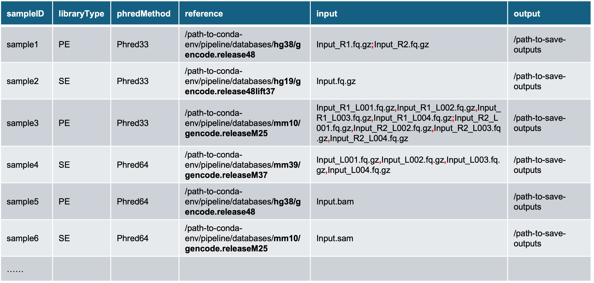

# Quick Tutorial for Running the Pipeline

---

Welcome to the **Quick Tutorial** for the bulk RNA-seq quantification pipeline! This tutorial aims to provide **immediate and practical guidance** for running this pipeline with your own data. As a quick tutorial, it is intended for users who are already familar with the basic concepts and tools of RNA-seq quantification analysis. If you are new to this field, we highly recommend starting with the **Full Tutorial**, which provides comprehensive documentation and step-by-step guidance.

To get started, activate the conda environment for this pipeline using the following commands:

``` bash
module load conda3/202402 # conda version: 24.1.2
conda activate /research_jude/rgs01_jude/groups/yu3grp/projects/software_JY/yu3grp/conda_env/bulkRNAseq_2025
```

If you are using a different conda environment, please change the path accordingly. To set up a conda environment for this pipeline, please refer to the [Pipeline Setup](https://jyyulab.github.io/bulkRNAseq_quantification_pipeline/docs/pipeline_setup/index) tutorial.

## I. Prepare the sample table

The **sample table** is a table summarizing the essential information for all input samples required for quantification analysis.  **It serves as the central input file for the pipeline: every step of this pipeline is performed based on the entries in this table.** Whether you have a single sample or thousands, you can list them all in this table. **This is the only input file required to run this pipeline.**

 Below is an example of the sample table for this pipeline:



  It is a **tab-delimited text file with 6 columns**:

1) **<u>sampleID</u>**: name of samples. Some rules apply:
   - Should contain **letters**, **numbers** or **underscores ONLY**;
   - Should **NOT start with numbers**.

2. **<u>libraryType</u>**: type of libraries, paired-end or single-end, **`[PE | SE]`**. 

   - For BAM/SAM file inputs, not sure about their library type? You can use the command below to determine the library type:

     ``` bash
     ## To tell the BAM/SAM files are single- or paired-end
     samtools view -c -f 1 input.bam
     # This command counts the matching records in the bam/sam file.
     # It returns 0 for single-end sequeing. Otherwise, the input bam/sam file is paired-end.
     ```

   - For FASTQ file inputs, you typically have two paired files for **`PE`** data or one single file for **`SE`**data. An exception, though exceedingly rare, is an **interleaved** FASTQ file, where both **mate1** and **mate2** reads are combined in a single file. ***This pipeline does not support interleaved FASTQ files as standard input.*** If you data is in this format, you will need to split it into two seperate FASTQ files before including them in your sample table.

     ```bash
     ## To split an interleaved FASTQ file
     fastp --interleaved_in --in1 interleaved.fq --out1 fqRaw_R1.fq.gz --out2 fqRaw.R2.fq.gz
     # Then, use 'PE' as the library type and use 'fqRaw_R1.fq.gz' and 'fqRaw_R2.fq.gz' as the input in your sample table
     ```

3. **<u>phredMethod</u>**: Phred quality score encoding method, **`[Phred33 | Phred64]`**.

   Not sure about the answer? These two guidelines can help you determine the correct Phred encoding method:

   - **Phred64** was retired in late 2011. Data genrated after that time should use **Phred33**.

   - You can use ***FastQC*** to identify the Phred encoding of your input files: 

     ``` bash
     ## To tell the Phred quality score encoding method in FASTQ/BAM/SAM files
     fastqc input.fq.gz # for FASTQ files
     fastqc input.bam # for BAM/SAM files
     # This command generates a html report. In the "Basic Statistics" section, there is a measure called "Endcoding":
     # "Sanger / Illumina 1.9" indicates Phred33, while "Illumina 1.5 or lower" indicates Phred64.
     ```

4. **<u>reference</u>**: path to reference genome database folder. This pipeline contains four pre-built databases:

   | Genome Assembly     | Path                                                         |
   | ------------------- | ------------------------------------------------------------ |
   | **hg38**/GRCh38.p14 | /research_jude/rgs01_jude/groups/yu3grp/projects/software_JY/yu3grp/conda_env/bulkRNAseq_2025/pipeline/databases/hg38/gencode.release48 |
   | **hg19**/GRCh37.p13 | /research_jude/rgs01_jude/groups/yu3grp/projects/software_JY/yu3grp/conda_env/bulkRNAseq_2025/pipeline/databases/hg19/gencode.release48lift37 |
   | **mm39**/GRCm39     | /research_jude/rgs01_jude/groups/yu3grp/projects/software_JY/yu3grp/conda_env/bulkRNAseq_2025/pipeline/databases/mm39/gencode.releaseM37 |
   | **mm10**/GRCm38.p6  | /research_jude/rgs01_jude/groups/yu3grp/projects/software_JY/yu3grp/conda_env/bulkRNAseq_2025/pipeline/databases/mm10/gencode.releaseM25 |

   If you are using a different conda environment, please change the paths accordingly. To set up a reference genome database, please refer to the [Database Preparation](https://jyyulab.github.io/bulkRNAseq_quantification_pipeline/docs/1_pipeline_setup/2_database.html) tutorial.

   - We recommend using **`hg38`** for human samples and **`mm39`** for mouse samples. The other assemblies, **`hg19`** and **`mm10`**, are primarily intended for compatibility with legacy data.
   - If you cannot acccess to the paths listed above, or if you require other genome assemblies, you will need to manually create the reference files by following the [Database Preparation](https://jyyulab.github.io/bulkRNAseq_quantification_pipeline/docs/1_pipeline_setup/2_database.html) tutorial.

5. **<u>input</u>**: input files for quantification. This pipeline accepts the following formats:

   - **<u>Standard FASTQ files</u>**: both paired-end (e.g., sample1) and single-end (e.g., sample2). Filenames must be ended with **`.fq`**, **`.fastq`**, **`.fq.gz`** or **`.fastq.gz`**. For paired-end samples, **mate1** and **mate2** should be catenated by **<u>*; (semicolon)*</u>**.

   - **<u>FASTQ files of multple lanes</u>**: both paired-end (e.g., sample3) and single-end (e.g., sample4). Filenames must be ended with **`.fq`**, **`.fastq`**, **`.fq.gz`** or **`.fastq.gz`**. The split FASTQ files of **mate1** and **mate2** must be listed in the same order and contenated using **<u>*, (comma)*</u>**.

   - **<u>BAM/SAM files</u>**: alignment files with filenames ending in **`.bam`**(e.g., sample 5) or **`.sam`** (e.g., sample6). Only one file per sample is accepted. If your sample consists of multiple BAM/SAM files (such as splited files), please merge them before proceeding:

     ``` bash
     samtools merge -o merged.bam input_1.bam input_2.bam ...
     ```

6. **<u>output</u>**: the directory where output files will be saved. This pipeline will create a subfolder named by the **`sampleID`** within this directory.


Below are the two ways we recommend to generate the sample table:

* Any coding language you prefer, e.g. BASH, R, Python, Perl *et. al.*

* **Excel** or **VIM**. And for you convince, we have a templete avaible here: `/research_jude/rgs01_jude/groups/yu3grp/projects/software_JY/yu3grp/conda_env/bulkRNAseq_2025/pipeline/testdata/sampleTable.testdata.txt`. You can simply copy it to your own folder and edit it using VIM. For those who can't access to the path, download the template file [here](https://github.com/jyyulab/bulkRNAseq_quantification_pipeline/blob/main/testdata/sampleTable.testdata.txt).

  

## II. Data preprocessing

The purpose of data preprocessing is to **prepare standard-in-format, clean-in-sequence FASTQ files** that can be directly used for downstream quantification analysis. It consists of two steps:

- **Data format standardization**: It converts input files, which may be in various formats (FASTQ, BAM, or SAM), into the standard FASTQ format. 

- **Adapter trimming**: It removes the adapeter sequences and low-quality bases from the reads.

  

1. **Data format standardization**

   To standardize the data format, you can run the command below:

   ``` bash
   ## 1. data format standardization
   /research_jude/rgs01_jude/groups/yu3grp/projects/software_JY/yu3grp/conda_env/bulkRNAseq_2025/pipeline/scripts/run/all2Fastq.pl sampleTable.txt
   ```

   This command will:

   - Create a folder, **`sampleID/preProcessing`**, in the output directory specified by the `output` column of sampleTable.txt.

   - Generate the **`sampleID/preProcessing/all2Fastq.sh`** file and submit it to the HPC queue.

     

   Typically, this step takes **5-10 mins** to complete (for 150M PE-100 reads). The stardard outputs are:

   - For PE library type: two paired FASTQ files, **`sampleID/preProcessing/fqRaw_R1.fq.gz`** and **`sampleID/preProcessing/fqRaw_R1.fq.gz`**
   - For SE library type: one single FASTQ file, **`sampleID/preProcessing/fqRaw.fq.gz`**

2. **Adapter trimming**

   You can perform the adapter trimming analysis by:

   ``` bash
   ## 2. adapter trimming
   /research_jude/rgs01_jude/groups/yu3grp/projects/software_JY/yu3grp/conda_env/bulkRNAseq_2025/pipeline/scripts/run/adapterTrimming.pl sampleTable.txt
   ```

   This command will:

   - Generate the **`sampleID/preProcessing/adapterTrimming.sh`** file and submit it to the HPC queue.

     

   Typically, this step takes **~5 mins** to complete (for 150M PE-100 reads). The stardard outputs are:

   - **adapter trimming reports** in differnt formats: **`sampleID/preProcessing/adapterTrimming.html`** and **`sampleID/preProcessing/adapterTrimming.json`**
   - **standard FASTQ files** with clean/filtered sequences:
     - For PE library type: two paired FASTQ files, **`sampleID/preProcessing/fqClean_R1.fq.gz`** and **`sampleID/preProcessing/fqClean_R1.fq.gz`**
     - For SE library type: one single FASTQ file, **`sampleID/preProcessing/fqClean.fq.gz`**

After completing these two preprocessing steps, you will have standard FASTQ files with clean sequences that are ready to be used in subsequent quantification analysis.


## III: Quantification

Though there are five quantification methods (see the table below) available in this pipleline, we use **Salmon** and **RSEM_STAR** as the default ones:

- **<u>Salmon</u>**: a wicked-fast alignment-free method. Its accuracy has been further enhanced with the  introduction of **decoy sequences**. <u>*Salmon can automatically determine the strandness of your data, and this information will be utilized by other methods*</u>. These features make it an excellent complement to alignment-based methods for cross-validation purpose.
- **RSEM_STAR**: an alignment-based method. We prefer STAR to Bowtie2 as the aligner for these two reasons: 1) **STAR** supports splice-aware alignment and hence usually produces higher mappling rates; 2) **STAR** is usually faster.

| Methods      | Aligner                  | Quantifier                   | Measures              | Levels           | Speed *   | Strandness                                              |
| :----------- | ------------------------ | ---------------------------- | --------------------- | ---------------- | --------- | ------------------------------------------------------- |
| Salmon       | NA                       | Salmon                       | Raw counts, TPM       | Gene, Transcript | ~30 mins  | automatically infer it                                  |
| RSEM_STAR    | STAR (splice-aware)      | RSEM                         | Raw counts, TPM, FPKM | Gene, Transcript | ~ 2 hrs   | manually set                                            |
| RSEM_Bowtie2 | Bowtie2 (splice-unaware) | RSEM                         | Raw counts, TPM, FPKM | Gene, Transcript | ~ 2.5 hrs | manually set                                            |
| STAR         | STAR (splice-aware)      | STAR (avilable since v2.5.0) | Raw counts            | Gene             | ~ 1 hrs   | Not required for alignment, but need for quantification |
| STAR_HTSeq   | STAR (splice-aware)      | HTSeq                        | Raw counts            | Gene, Transcript | ~ 1 hrs   | Not required for alignment, but need for quantification |

<sup>**\***: tested with 150 million PE-100 reads.</sup>

### 1. Salmon

You can run Salmon quantification with the commands below:

``` bash
## 1. quantification by Salmon
/research_jude/rgs01_jude/groups/yu3grp/projects/software_JY/yu3grp/conda_env/bulkRNAseq_2025/pipeline/scripts/run/quantSalmon.pl sampleTable.txt
```

This command will:

- Create a folder: **`/path-to-save-outputs/sampleID/quantSalmon`**
- Generate the script: **`/path-to-save-outputs/sampleID/quantSalmon/quantSalmon.sh`** and submit it to the HPC queue.

Typically, this step takes **~30 mins** to complete (for 150M PE-100 reads). The stardard outputs are:

- quantification results: **`quant.genes.sf`** for genes, and **`quant.sf`** for transcripts.

- strandness estimation result: **`lib_format_counts.json`**. The row, "**expected_format**", indicates the estimated strandness:

  | Salmon (--libType) | RSEM (--strandedness) | TopHap (--library-type) | HTSeq (--stranded) |
  | ------------------ | --------------------- | ----------------------- | ------------------ |
  | U/IU               | none                  | -fr-unstranded          | no                 |
  | SR/ISR             | reverse               | -fr-firststrand         | reverse            |
  | SF/ISF             | forward               | -fr-secondstrand        | yes                |

- some other files/folders

### 2. RSEM_STAR 

***<u>NOTE</u>***: This method determines library strandness based on the outputs from Salmon. Please ensure that all Salmon jobs have finished before proceeding.

You can run the quantification analysis with RSEM_STAR method using the commands below:

``` bash
## 2. quantification by RSEM-STAR
/research_jude/rgs01_jude/groups/yu3grp/projects/software_JY/yu3grp/conda_env/bulkRNAseq_2025/pipeline/scripts/run/quantRSEM_STAR.pl sampleTable.txt
```

This command will:

- Create a folder: **`/path-to-save-outputs/sampleID/quantRSEM_STAR`**
- Generate the script: **`/path-to-save-outputs/sampleID/quantRSEM_STAR/quantRSEM_STAR.sh`** and submit it to the HPC queue.

Typically, this step takes **~2 hrs** to complete (for 150M PE-100 reads). The stardard outputs are:

- quantification results: **`quant.genes.results`** for genes, and **`quant.isoforms.results`** for transcripts.
- transcriptome alignment result: **`quant.transcript.sorted.bam`**. This file is sorted by coordinates and has been indexed. The gene body coverage analysis in the QC report is condcuted on this file.
- mapping rate statistics: **`quant.stat/quant.cnt`**. This file contains the statistics of alignment and will be used in the QC report generation.
- some other files/folders


## IV: Summarization

The **Summarization** analysis processes the outputs of both **Salmon** and **RSEM_STAR** quantification analyses, and generates a comprehensive HTML quality control (QC) report for each sample. If multiple samples are provided, the analysis will also produce an universal QC report and gene expressioin matrix that includes all samples.

The summarization analysis consists of three steps:

- **calculate gene body coverage**: this is a widely-used metrics indicating the extend of RNA degradation.
- **generate QC report for individual samples**: this produces a HTML QC report for each sample.
- **generate QC report for all samples**: this produces a HTML QC report for all samples. This is only needed when multiple samples are provided.

1. **Calculate gene body coverage**

   **Gene body coverage** refers to how evenly sequencing reads are distributed along the length of a gene's transcript, from the 5' end to the 3' end. **RNA degradation** typically occurs from the ends of RNA molecules, most often starting at the 5' end. If the RNA is degraded, we often see a bias, a "drop-off" of coverage, at either end. So, by examining gene body coverage, we can detect whether the RNA samples are intact or degraded.

   

   You can calcuate the gene body coverage using the command below:

   ``` bash
   ## 1. calculate gene body coverage
   /research_jude/rgs01_jude/groups/yu3grp/projects/software_JY/yu3grp/conda_env/bulkRNAseq_2025/pipeline/scripts/run/genebodyCoverage.pl sampleTable.txt
   ```

   This command will:

   - Generate the script: **`/path-to-save-outputs/sampleID/quantRSEM_STAR/genebodyCoverage.sh`** and submit it to the HPC queue.

   Typically, this step takes **~5 mins** to complete (for 150M PE-100 reads). The stardard outputs are:

   - gene body coverage results: **`genebodyCoverage.txt`**. It saves the raw counts of reads distributed in each bin of the longest transcripts of housekeeping/all genes.

   - some other files/folders

2. **Generate QC report for individual samples**

   The QC report for individual samples summarizes key statistics and quality control metrics of the quantification analysis:

   - Alignment statistics: key statistics of alignment.

   - Quantification statistics: numbers of genes and transcripts identified by Salmon and RSEM_STAR, and their overlaps.

   - Biotype distribution: compositons of gene types at both gene- and transcript-level.

   - Quantification accuracy: correlations of abundance quantified by Salmon and RSEM at both gene- and transcript-level.

   - Genebody coverage statistics: visualization and statistics of gene body coverage: mean of coverage, coefficient of skewness.

     

   You can generate this QC report using the command below:

   ``` bash
   ## 2. generate QC reports for individual samples
   /research_jude/rgs01_jude/groups/yu3grp/projects/software_JY/yu3grp/conda_env/bulkRNAseq_2025/pipeline/scripts/run/summarizationIndividual.pl sampleTable.txt
   ```

   This command will:

   - Generate the script: **`/path-to-save-outputs/sampleID/summarization/summarization.sh`** and submit it to the HPC queue.

   Typically, this step takes **~5 mins** to complete (for 150M PE-100 reads). The stardard outputs are:

   - the HTML QC report: **`summarization.html`** (e.g., [example for sample1](https://github.com/jyyulab/bulkRNAseq_quantification_pipeline/blob/main/testdata/summarization_individual.html)).

   - quantification results by both **Salmon** and **RSEM_STAR**: **`quant.genes.txt`** for genes, and **`quant.transcripts.txt`** for transcripts.

   - some other files/folders

3. **Generate QC report for multiple samples**

   Slightly different from the one for single samples, the QC report for multiple samples contains:

   - Paths to the universal Gene Expression Matries: These matries are for raw counts, TPM and FPKM measures at both gene- and transcript-level quantified by Salmon and RSEM_STAR.
   - Alignment statistics: key statistics of alignment, with all samples combined together.
   - Quantification statistics: numbers of genes and transcripts identified by Salmon and RSEM_STAR, their overlaps and correlations. All samples are combined together.
   - Biotype distribution: compositons of gene types at both gene- and transcript-level, with all samples combined together.
   - Genebody coverage statistics: visualization and statistics of gene body coverage: mean of coverage, coefficient of skewness. All samples are combined together.

   You can generate this QC report using the command below:

   ``` bash
   ## 3. generate QC reports for multiple samples
   /research_jude/rgs01_jude/groups/yu3grp/projects/software_JY/yu3grp/conda_env/bulkRNAseq_2025/pipeline/scripts/run/summarizationMultiple.pl sampleTable.txt absolute-path-to-save-outputs
   ```

   This command will first count the number of reference genome assemblies (Column #4) involved in the **`sampleTable.txt`**, and:

   - Create a folder for each reference genome assembly in the directory of `absolute-path-to-save-outputs` named by the string of reference genome assembly with the "/" being replaced by "_". You are free to rename them after the analysis is complete.
   - Splite the **`sampleTable.txt`** by reference genome assemblies into sub-ones (also named **`sampleTable.txt`**) and save them in the corresponding folders created above.
   - Generate a script: **`summarizationMultiple.sh`** in each folder and submit them to the HPC queue.

   Typically, this step takes **~10 mins** to complete (for 150M PE-100 reads). The stardard outputs are:

   - the HTML QC report: **`summarizationMultiple.html`** (e.g., [example for sample1](https://github.com/jyyulab/bulkRNAseq_quantification_pipeline/blob/main/testdata/summarization_multiple.html)).

   - gene expression matries of raw counts, TPM and FPKM, at both gene and transcript levels, and by both **Salmon** and **RSEM_STAR**: **`01_expressMatrix.*.txt`**

   - some other files/folders


