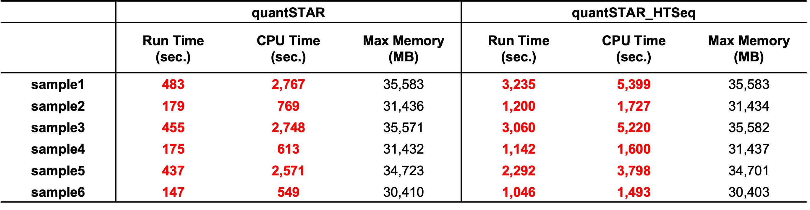

# II: Quantification

---

## How did we select the quantification methods?

Currently, bulk RNA-seq quantification methods can be grouped into two categories, **alignment-based** and **alignment-free**, as summarized in the table below:

|            | Alignment-based methods                                      | Alignment-free methods                                       |
| ---------- | ------------------------------------------------------------ | ------------------------------------------------------------ |
| Definition | Methods that quanfity from the **alignments to either transcritpome or genome** (i.e. BAM/SAM files). The coordinates of mapped reads are provided. | Methdos that quantify from **read-transcript matches**. The coordinates of mapped reads are **NOT** provided. |
| Principle  | "Seed and extend" for aligners.<br />Quantifiers vary in rules and weighting methods for read counting. | ***k***-mer-based indexing;<br />Multiple models to identify read-transcript matches,<br /> e.g. SEMEs for Salmon, T-DBG for Kallisto |
| Examples   | **Aligners**: Bowtie/Bowtie2, STAR, BWA, HISAT2, TopHat2, *et. al.*<br />**Quantifiers**: RSEM, HTSeq, featureCounts, IsoEM, Cufflinks *et. al.* | Salmon, Kallisto, Sailfish, Fleximer, RNA-Skim, RapMap, *et. al.* |
| Accuracy   | High                                                         | Slightly lower or comparable                                 |
| Speed      | Slow (hours per run)                                         | Super-fast (minutes per run)                                 |

**<u>Our approach to ensure quantification accuracy is cross validation: if abundance estimated from two different methods are highly correlated (correlation coefficient > 0.9), the quantification results are most likely accurate.</u>** Based on this, we select one signature method from each of these two categories. 

- **RSEM_STAR**: An alignment-based method with exceptional accuracy. It has been used as gold standard in many benchmarking studies.

- **Salmon**: a wicked-fast alignment-free method. Its accuracy has been further enhanced with the introduction of **decoy sequences**. 

In addition to these two methods, we also include another alignment-base method in this pipeline:

- **STAR_HTSeq**: This method is used in the [GDC mRNA quantification analysis pipeline](https://docs.gdc.cancer.gov/Data/Bioinformatics_Pipelines/Expression_mRNA_Pipeline).

  > ***NOTE***:
  >
  > **By default, this method only counts uniquely-mapped reads, which can significantly unsterestimate the expression of genes belonging to large gene families.** GDC employes STAR in its pipeline primarily because it also needs to identify transcript fusion events. For quantification purpose along, **we recommend using this method only when you need to match GDC-generated quantification results** which are widely used in many public data portals.


## 1. Salmon

[Salmon](https://salmon.readthedocs.io/en/latest/salmon.html) is a bulk RNA-Seq quantifier with **wicked-fast speed** and **comparable accuracy**. It provides two working modes:

* **Mapping-based mode**: this is the feature mode that makes Salmon famous. Samlon employes a SEME (super maximal exact match)-based chaining algorithm to find and score potential mapping loci, making it super fast (because no alignment is needed) and comprably accurate. Since version 1.0.0, Salmon also supports **Selective Alignment** and **Decoy Sequences** for improved quantification accuracy (Check [here](https://genomebiology.biomedcentral.com/articles/10.1186/s13059-020-02151-8) for more details).
* **Alignment-based mode**: Salmon is not an aligner, so in this mode, though called alignment-based, it does NOT accept FASTQ files. Instead, you can simply provide: 1) BAM/SAM files of alignments generated by other aligners (e.g., STAR, Bowtie), and 2) FASTA file of the reference transcriptome. No indexing is required for this mode.

In this pipeline, we suggest to **use the mapping-based mode ONLY**. 

```bash
## Quantification by Salmon
# For paired-end sequencing data
salmon quant \
	-i /path-to-database/bulkRNAseq/Salmon/index_decoy \
	-l A \
	-p 8 \
	-g /path-to-database/annotation.gtf \
  -1 /path-to-save-outputs/preProcessing/fqClean_R1.fq.gz \
  -2 /path-to-save-outputs/preProcessing/your_path/fqClean_R2.fq.gz \
  --validateMappings \
  -o /path-to-save-outputs/quantSalmon

# For single-end sequencing data
salmon quant \
	-i /path-to-database/bulkRNAseq/Salmon/index_decoy \
	-l A \
	-p 8 \
	-g /path-to-database/annotation.gtf \
	-r /path-to-save-outputs/preProcessing/fqClean.fq.gz \
	--validateMappings \
	-o /path-to-save-outputs/quantSalmon
```

**<u>Key arguments:</u>**

Salmon is very smart, It could learn most of the arguments by itseft. So there are only a few arguments you need to specify, making it super easy to use.

* **`-l/--libType`**: Library type. Salmon employs a three-letter string to denote the [library type](https://salmon.readthedocs.io/en/latest/library_type.html#fraglibtype): 1) the relative orientation of two matched mates, including **I = inward**, O = outward and **M = matching**; 2) the protocol is stranded or unstranded, including **S = stranded** and **U = unstranded**; 3) the strand from which the read originates in a strand-specific protocol, including **F = read 1 (or single-end read) from the forward stand** and **R =  read 1 (or single-end read) from the reverse stand**. As a result, there are 9 library types: **3 for unstranded library (IU, MU, OU)** and **6 for stranded library (ISF, ISR, MSF, MSR, OSR, OSF)**, as shown below. In this pipeline, we use **"A"** (auto) as the default, which asks Salmon to infer it automatically.

  

* **`-i/--index`**: Path to Salmon indexing files. By default, they can be found at: `/path-to-databases/bulkRNAseq/Salmon/index_decoy` .

  We have pre-built them for four reference genome assemblies:

  | Reference genome  assembly | Path                                                         |
  | -------------------------- | ------------------------------------------------------------ |
  | `hg38`                     | `/research_jude/rgs01_jude/groups/yu3grp/projects/software_JY/yu3grp/conda_env/bulkRNAseq_2025/pipeline/databases/hg38/gencode.release48/bulkRNAseq/Salmon/index_decoy` |
  | `hg19`                     | `/research_jude/rgs01_jude/groups/yu3grp/projects/software_JY/yu3grp/conda_env/bulkRNAseq_2025/pipeline/databases/hg19/gencode.release48lift37/bulkRNAseq/Salmon/index_decoy` |
  | `mm39`                     | `/research_jude/rgs01_jude/groups/yu3grp/projects/software_JY/yu3grp/conda_env/bulkRNAseq_2025/pipeline/databases/mm39/gencode.releaseM37/bulkRNAseq/Salmon/index_decoy` |
  | `mm10`                     | `/research_jude/rgs01_jude/groups/yu3grp/projects/software_JY/yu3grp/conda_env/bulkRNAseq_2025/pipeline/databases/mm10/gencode.releaseM25/bulkRNAseq/Salmon/index_decoy` |

* **`-g/--geneMap`**: File contaning a mapping of transcript to gene. By default, they can be found at: `/path-to-databases/annotation.gtf` .

  **This is required to genereate the gene-level abundance estimates.** We have pre-built them for four reference genome assemblies:

  | Reference genome  assembly | Path                                                         |
  | -------------------------- | ------------------------------------------------------------ |
  | `hg38`                     | `/research_jude/rgs01_jude/groups/yu3grp/projects/software_JY/yu3grp/conda_env/bulkRNAseq_2025/pipeline/databases/hg38/gencode.release48/annotation.gtf` |
  | `hg19`                     | `/research_jude/rgs01_jude/groups/yu3grp/projects/software_JY/yu3grp/conda_env/bulkRNAseq_2025/pipeline/databases/hg19/gencode.release48lift37/`annotation.gtf |
  | `mm39`                     | `/research_jude/rgs01_jude/groups/yu3grp/projects/software_JY/yu3grp/conda_env/bulkRNAseq_2025/pipeline/databases/mm39/gencode.releaseM37/annotation.gtf` |
  | `mm10`                     | `/research_jude/rgs01_jude/groups/yu3grp/projects/software_JY/yu3grp/conda_env/bulkRNAseq_2025/pipeline/databases/mm10/gencode.releaseM25/annotation.gtf` |

* **`-p/--threads`**: Number of threads to use concurrently. Default: 8.

<u>**Key outputs**</u>: (for more details: https://salmon.readthedocs.io/en/latest/file_formats.html#fileformats)

* **`quant.sf`**: Contains transcript-level abundance estimates, TPM and raw counts.

* **`quant.genes.sf`**: Contains the aggregated gene-level abundance estimates, TPM and raw counts.

* **`lib_format_counts.json`**: This file contains the infered library type, which can be found from the line of "**expected_format**".

  Here is a summary of library types used for different tools:
  
  | Salmon (`--libType`, SE/PE) | RSEM (`--strandedness`) | TopHap (`--library-type`) | HTSeq (`--stranded`) |
  | --------------------------- | ----------------------- | ------------------------- | -------------------- |
  | `U/IU`                      | `none`                  | `-fr-unstranded`          | `no`                 |
  | `SR/ISR`                    | `reverse`               | `-fr-firststrand`         | `reverse`            |
  | `SF/ISF`                    | `forward`               | `-fr-secondstrand`        | `yes`                |


## 2. RSEM_STAR

[**RSEM**](https://github.com/bli25/RSEM_tutorial) (RNA-Seq by Expectation Maximization) is an accurate and user-friendly software tool for quantifying transcript and gene abundances from RNA-seq data.

* **RSEM** is a quantifier, not an aligner. **RSEM** can directly take the FASTQ files, but it does not align the reads by itself. Instead, it empolys **STAR** or **Bowtie2** for reads alignment.
* **RSEM** doesn't rely on the existence of a reference genome. It quantifies from the alignments to reference transcriptome.
* **RSEM** is famouse for its ability to **effectively use ambiguously-mapping reads**. This is the main reason for its high quantification accuracy.

In this pipeline, we use **STAR as the default aligner** for **RSEM**. **STAR** (Spliced Transcripts Alignment to a Reference) was uniquely designed for RNA-Seq alignment. It's ultrafast and it does support the spliced alignment. For more details: https://www.ncbi.nlm.nih.gov/pmc/articles/PMC3530905/.

> ***Question: Why do we prefer STAR to Bowtie2 as the aligner?***
>
> There are mainly two reasons:
>
> 1. **STAR** usually produces higher mappling rates. Bowtie2 was originally designed for genome alignment, so it doesn't support the spliceaware alignment which is important for transcriptome alignment. In contrat, STAR is splice-aware.
>
>    
>
> 2. **STAR** is generally faster.
>
>    

```bash
## Quantification by RSEM_STAR
## For paired-end sequencing
rsem-calculate-expression -num--threads 8 \
	--star --star-path /research_jude/rgs01_jude/groups/yu3grp/projects/software_JY/yu3grp/conda_env/bulkRNAseq_2025/bin \
	--star-gzipped-read-file \
	--strandedness reverse --phred33-quals \
	--sort-bam-by-coordinate \
	--paired-end /path-to-save-outputs/preProcessing/fqClean_R1.fq.gz /path-to-save-outputs/preProcessing/fqClean_R2.fq.gz \
	/path-to-database/bulkRNAseq/RSEM/index_star /path-to-save-outputs/quantRSEM_STAR

## For single-end sequencing
rsem-calculate-expression -num--threads 8 \
	--star --star-path /research_jude/rgs01_jude/groups/yu3grp/projects/software_JY/yu3grp/conda_env/bulkRNAseq_2025/bin \
	--star-gzipped-read-file \
	--strandedness reverse --phred33-quals \
	--sort-bam-by-coordinate \
	/path-to-save-outputs/preProcessing/fqClean.fq.gz \
	/path-to-database/bulkRNAseq/RSEM/index_star /path-to-save-outputs/quantRSEM_STAR
```

**<u>Key arguments:</u>**

- **`--strandedness [none|forward|reverse]`**: strandness of library. This pipeline will automatically extract it from the **lib_format_counts.json** generated by Salmon, as mentioned before.

**<u>Key outputs</u>**: (for more details: https://salmon.readthedocs.io/en/latest/file_formats.html#fileformats)

* **`quant.genes.results`**: **gene-level** quantificaiton results
* **`quant.isoforms.results`**: **transcript-level** quantificaiton results
* **`quant.transcript.sorted.bam`**: transcriptome alignment result. This file is sorted by coordinates and has been indexed. The gene body coverage analysis in the QC report is condcuted on this file.
* **`quant.stat/quant.cnt`**: This file contains the statistics of transcriptome alignment and is used to generate the QC report.

Following the RSEM tutorial, we also provide the codes for **RSEM_Bowtie2** in which Bowtie2 is used as the aligner for RSEM:

``` bash
## Quantification by RSEM_Bowtie2
## For paired-end sequencing
rsem-calculate-expression -num--threads 8 \
	--bowtie2 --bowtie2-path /research_jude/rgs01_jude/groups/yu3grp/projects/software_JY/yu3grp/conda_env/bulkRNAseq_2025/bin \
	--star-gzipped-read-file \
	--strandedness reverse --phred33-quals \
	--sort-bam-by-coordinate \
	--paired-end /path-to-save-outputs/preProcessing/fqClean_R1.fq.gz /path-to-save-outputs/preProcessing/fqClean_R2.fq.gz \
	/path-to-database/bulkRNAseq/RSEM/index_star /path-to-save-outputs/quantRSEM_STAR

## For single-end sequencing
rsem-calculate-expression -num--threads 8 \
	--bowtie2 --bowtie2-path /research_jude/rgs01_jude/groups/yu3grp/projects/software_JY/yu3grp/conda_env/bulkRNAseq_2025/bin \
	--star-gzipped-read-file \
	--strandedness reverse --phred33-quals \
	--sort-bam-by-coordinate \
	/path-to-save-outputs/preProcessing/fqClean.fq.gz \
	/path-to-database/bulkRNAseq/RSEM/index_star /path-to-save-outputs/quantRSEM_STAR
```

The key arguments and outputs for **RSEM_Bowtie2** are exactly same with those of **RSEM_STAR**.


## 3. STAR_HTSeq

[**STAR**](https://github.com/alexdobin/STAR/blob/master/doc/STARmanual.pdf) is a splice-aware aligner that designed for transcritptome alignement. Its **two-pass alignment approach** makes it a powerful tool in identifying alternative splicing and transcript fusion events. From version 2.4.2a released in 2015, **STAR can also serve as a quantifier**. And since Data Release 32 (2022), GDC has removed HTSeq from its pipeline and use STAR as the default quantifier.

> ***Question: What quantifier should I use in this method, STAR or HTSeq?***
>
> **[HTSeq](https://htseq.readthedocs.io/en/latest/)** and **STAR** share a few features in terms of quantification analysis:
>
> - **The rules to count the mapped reads are almost same.** They don't count ambiguously-mapped reads and they do not weight the reads by either their overlaps with the reference genes or mapping scores.
>
>   
>
> - **They both estimate raw counts only**. For TPM or FPKM values, you will have to calculate them by your self.
>
> The main difference is that ***STAR only performs gene-level quantification, whereas HTSeq can quantify at the gene, transcript and even exon levels***. Therefore, **if you need transcript-level quantification, HTSeq is the only option**. Additionally, STAR performs quantification during the alignment process, while HTSeq quantifies after alignment is complete. This is saying, **HTSeq generally takes longer to complete quantification.**
>
> 

With this method, the abundance estimates by both STAR and HTSeq will be generated simultaneously:

```bash
## Quantification by STAR_HTSeq
## Alignment by STAR: for paired-end sequencing data
STAR \
	--readFilesIn /path-to-save-outputs/preProcessing/fqClean_R1.fq.gz /path-to-save-outputs/preProcessing/fqClean_R2.fq.gz \
	--outFileNamePrefix /path-to-save-outputs/quantSTAR_HTSeq \
	--outSAMattrRGline ID:SampleName SM:SampleName LB:Illumina PL:Illumina PU:Illumina \
	--genomeDir /path-to-database/bulkRNAseq/STAR/index_overhang100 \
	--readFilesCommand zcat \
	--runThreadN 8 \
	--twopassMode Basic \
	--outFilterMultimapNmax 20 \
	--alignSJoverhangMin 8 \
	--alignSJDBoverhangMin 1 \
	--outFilterMismatchNoverLmax 0.1 \
	--alignIntronMin 20 \
	--alignIntronMax 1000000 \
	--outFilterType BySJout \
	--outFilterScoreMinOverLread 0.33 \
	--outFilterMatchNminOverLread 0.33 \
	--limitSjdbInsertNsj 1200000 \
	--outSAMstrandField intronMotif \
	--outFilterIntronMotifs None \
	--alignSoftClipAtReferenceEnds Yes \
	--quantMode TranscriptomeSAM GeneCounts \
	--outSAMtype BAM SortedByCoordinate \
	--outSAMunmapped Within \
	--genomeLoad NoSharedMemory \
	--chimSegmentMin 15 \
	--chimJunctionOverhangMin 15 \
	--chimOutType Junctions SeparateSAMold WithinBAM SoftClip \
	--chimOutJunctionFormat 1 \
	--chimMainSegmentMultNmax 1 \
	--outSAMattributes NH HI AS nM NM ch
	
## Alignment by STAR: for single-end sequencing data
STAR \
	--readFilesIn /path-to-save-outputs/preProcessing/fqClean.fq.gz \
	--outFileNamePrefix /path-to-save-outputs/quantSTAR_HTSeq \
	--outSAMattrRGline ID:SampleName SM:SampleName LB:Illumina PL:Illumina PU:Illumina \
	--genomeDir /path-to-database/bulkRNAseq/STAR/index_overhang100 \
	--readFilesCommand zcat \
	--runThreadN 8 \
	--twopassMode Basic \
	--outFilterMultimapNmax 20 \
	--alignSJoverhangMin 8 \
	--alignSJDBoverhangMin 1 \
	--outFilterMismatchNoverLmax 0.1 \
	--alignIntronMin 20 \
	--alignIntronMax 1000000 \
	--outFilterType BySJout \
	--outFilterScoreMinOverLread 0.33 \
	--outFilterMatchNminOverLread 0.33 \
	--limitSjdbInsertNsj 1200000 \
	--outSAMstrandField intronMotif \
	--outFilterIntronMotifs None \
	--alignSoftClipAtReferenceEnds Yes \
	--quantMode TranscriptomeSAM GeneCounts \
	--outSAMtype BAM SortedByCoordinate \
	--outSAMunmapped Within \
	--genomeLoad NoSharedMemory \
	--chimSegmentMin 15 \
	--chimJunctionOverhangMin 15 \
	--chimOutType Junctions SeparateSAMold WithinBAM SoftClip \
	--chimOutJunctionFormat 1 \
	--chimMainSegmentMultNmax 1 \
	--outSAMattributes NH HI AS nM NM ch

## Quantification by HTSeq
# gene-level quantification
htseq-count -f bam -r pos -s reverse -i gene_id -m intersection-nonempty -n 8 /path-to-save-outputs/quantSTAR_HTSeq/Aligned.out.bam /path-to-database/annotation.gtf > /path-to-save-outputs/quantSTAR_HTSeq/htseq_counts.genes.txt

# transcript-level quantification
htseq-count -f bam -r pos -s reverse -i transcript_id -m intersection-nonempty -n 8 /path-to-save-outputs/quantSTAR_HTSeq/Aligned.out.bam /path-to-database/annotation.gtf > /path-to-save-outputs/quantSTAR_HTSeq/htseq_counts.transcripts.txt

```

**<u>Key arguments</u>**:

Most of the arguments used in the commands are from [GDC mRNA quantification analysis pipeline](https://docs.gdc.cancer.gov/Data/Bioinformatics_Pipelines/Expression_mRNA_Pipeline). The key arguments include:

- **`--quantMode`**: for STAR. "**GeneCounts**" here enables the gene-level quantification by STAR.
- **`-s/--stranded`**: for HTSeq. It specifies the strandness of library, **`[no|yes|reverse]`**.
- **`-r/--order`**: for HTSeq. It specifies the input BAM/SAM file is sorted by name or coordinate, **`[name|pos]`**.

**<u>Key outputs:</u>**

* **`ReadsPerGene.out.tab`**: gene-level quantification results by STAR.
* **`htseq_counts.genes.txt`**: contains gene-level abundance estimates by HTSeq, raw counts only.
* **`htseq_counts.transcripts.txt`**: contains transcript-level abundance estimates by HTSeq, raw counts only.
* **`Aligned.sortedByCoord.out.bam`**: BAM file with alignments to reference genome, sorted by coordinates.
* **`Aligned.toTranscriptome.out.bam`**: BAM file with alignments to reference transcriptome.
* **`Log.final.out`**: contains alignment statistics generated by STAR. This file provides the number of totally-mapped and uniquely-mapped reads used in the final QC report.
