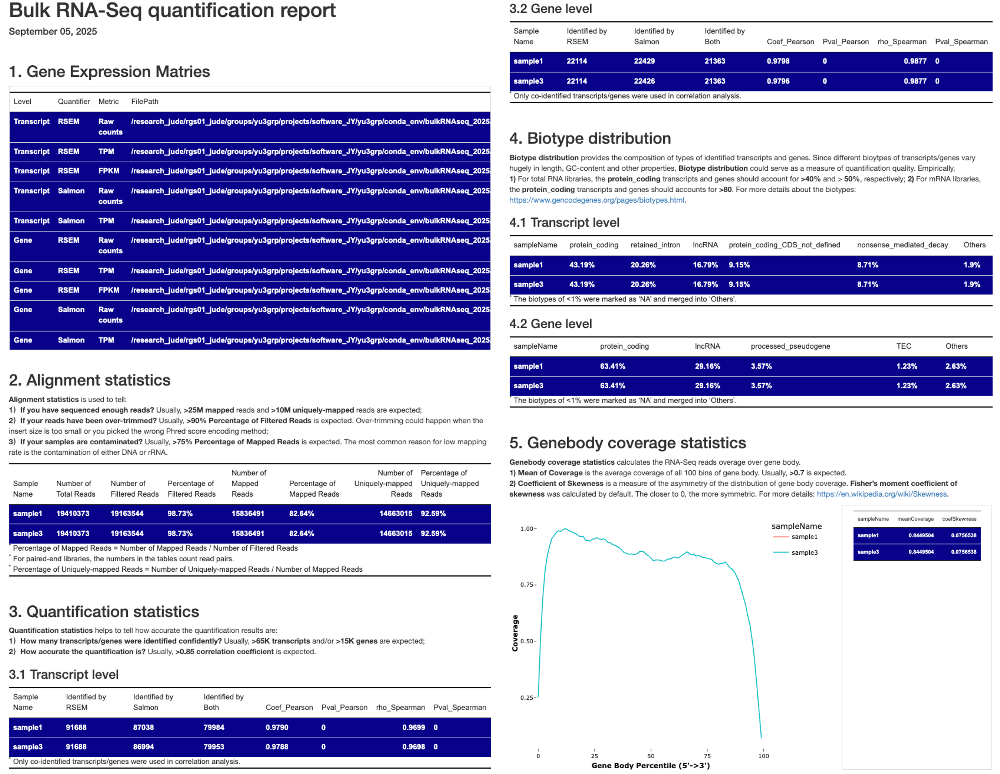

# III. Summarization

---

## Why is Summarization necessary?

After quantification with Salmon, RSEM, or other tools, it's essential to assess the reliability and quality of your quantification results. Summarization analysis here serves two key purposes:

- Comprehensive quality assessment of your quantification analysis

- Generation of a universal gene expression matrix containing all samples, formatted for easy downstream analysis (e.g., diffferential expression, clustering)

  

## 1. Gene body coverage statistics

A major concern for RNA-seq data quality is **RNA degradation**. RNA molecules are highly susceptible to degradation by ubiquitous RNases. A exposure to the RNase for a couple of minutes can cause significant RNA decay, especially for mRNA. So, we introduced the gene body coverage statistics to help us tell if the input samples are degraded or not. 

**Gene body coverage** measures how evenly sequencing reads are distributed along the length of a gene's transcript, from the 5' end to the 3' end. **RNA degradation** typically starts from the ends of RNA molecules, particularly at the 5' end. When RNA is degraded, this results in a coverage bias, typically a noticeable "drop-off" at one or both ends of the transcript.

In this pipeline, we bin the longest transcripts of housekeeping genes (default; an all-gene version is also available) into 100 equal-length fragments (**`genebodyBins_housekeeping.txt`**). We then count the reads mapped to each bin using transcriptome alignments (**`quant.transcript.sorted.bam`**):

```bash
## 1. gene body coverage statistics
# Housekeeping genes
bedtools multicov \
	-bams /path-to-save-outputs/quantRSEM_STAR/quant.transcript.sorted.bam \
	-bed /path-to-database/bulkRNAseq/genebodyBins/genebodyBins_housekeeping.txt > /path-to-save-outputs/quantRSEM_STAR/genebodyCoverage.txt

# All genes
bedtools multicov \
	-bams /path-to-save-outputs/quantRSEM_STAR/quant.transcript.sorted.bam \
	-bed /path-to-database/bulkRNAseq/genebodyBins/genebodyBins_all.txt > /path-to-save-outputs/quantRSEM_STAR/genebodyCoverage.txt
```

The only output in this step is the **`genebodyCoverage.txt`** file. It contains the counts of reads mapped to each of the pre-generated bins of selected transcripts. This file will be used to generate the HTML quality control report.

## 2. Individual sample QC report

The QC report for individual samples (see below) summarizes key statistics and quality control metrics from the preprocessing and quantification analyses, including:

- **Alignment statistics**: Key statistics of transcriptome alignment.
- **Quantification statistics**: Numbers of genes and transcripts identified by **Salmon** and **RSEM_STAR**, as well as their overlaps.
- **Biotype distribution**: Compositon of gene types at both gene and transcript levels.
- **Quantification accuracy**: Correlation of abundance estimates by **Salmon** and **RSEM_STAR** at both gene and transcript levels.
- **Genebody coverage statistics**: **Visualization** and statistics of gene body coverage, including **Mean of Coverage**, **Coefficient of Skewness**.


To generate this report, we created a R markdown script, **`summarizationIndividual.Rmd`**, which collects information from the files list below:

* `/path-to-save-outputs/preProcessing/adapterTrimming.json`: for **Alignment statistics**.
* `/path-to-save-outputs/quantRSEM/quant.stat/quant.cnt`: for **Quantification statistics**.
* `/path-to-save-outputs/quantRSEM/genebodyCoverage.txt`: for **Genebody coverage statistics**.
* `/path-to-save-outputs/quantRSEM/quant.isoforms.results`: for **Biotype distribution** and **Quantification accuracy** at the transcript-level.
* `/path-to-save-outputs/quantRSEM/quant.genes.results`:  for **Biotype distribution** and **Quantification accuracy** at the gene-level.
* `/path-to-save-outputs/quantSalmon/quant.sf`: for **Quantification accuracy** at the transcript-level.
* `/path-to-save-outputs/quantSalmon/quant.genes.sf`: for **Quantification accuracy** at the gene-level.

You can generate this report using the following commands:

``` bash
## 2. generate QC reports for individual samples
# For one sample
Rscript -e "rmarkdown::render(input = '/research_jude/rgs01_jude/groups/yu3grp/projects/software_JY/yu3grp/conda_env/bulkRNAseq_2025/pipeline/scripts/run/summarizationIndividual.Rmd', clean = TRUE, quiet = F, output_format = 'html_document', output_file = 'summarization.html', output_dir = '/path-to-save-ouputs/sampleID/summarization', params = list(sampleName = 'sample1', dir_quant = '/path-to-save-ouputs/sampleID', dir_anno = './bulkRNAseq_2025/pipeline/databases/hg38/gencode.release48'))"

# For multiple samples involved in sampleTable.txt
/research_jude/rgs01_jude/groups/yu3grp/projects/software_JY/yu3grp/conda_env/bulkRNAseq_2025/pipeline/scripts/run/summarizationIndividual.pl sampleTable.txt
```

This command will:

- Generate the script: **`/path-to-save-outputs/sampleID/summarization/summarization.sh`** and submit it to HPC queues.

Typically, this step takes **~5 mins** to complete (for 150M PE-100 reads). The stardard outputs include:

- **`summarization.html`**: an HTML-format file containg the quality control metrics above (e.g., [example for sample1](https://github.com/jyyulab/bulkRNAseq_quantification_pipeline/blob/main/testdata/summarization_individual.html)).

- **`quant.genes.txt`**: **gene-level** quantification resluts by both **Salmon** and **RSEM_STAR**.

- **`quant.transcripts.txt`**: **transcript-level** quantification resluts by both **Salmon** and **RSEM_STAR**.

- Some other files/folders

## 3. Combined QC report

The QC report for multiple samples **differs slightly** from the single-sample version and includes the following:

- **Paths to the gene expression matries summarizing all samples**: Contains paths to matrices of **raw counts**, **TPM** and **FPKM** values at both gene and transcript levels, quantified by **Salmon** and **RSEM_STAR**.
- **Alignment statistics**: Summarize key transcriptome alignment statistics of all samples.
- **Quantification statistics**: Reports the number of genes and transcripts identified by **Salmon** and **RSEM_STAR**, their overlaps, and correlations, with all samples combined.
- **Biotype distribution**: Shows the compositon of gene types at both gene and transcript levels, aggregated across all samples.
- **Genebody coverage statistics**: Includes visualizations and summary statistics (such as Mean of Coverage, Coefficient of Skewness) for gene body coverage, with all samples combined.



You can generate this QC report using the command below:

``` bash
## 3. generate QC reports for multiple samples
/research_jude/rgs01_jude/groups/yu3grp/projects/software_JY/yu3grp/conda_env/bulkRNAseq_2025/pipeline/scripts/run/summarizationMultiple.pl sampleTable.txt /absolute-path-to-save-outputs
```

This command will first **count the number of reference genome assemblies** (Column #4) present in your **`sampleTable.txt`**, and then:

- **Create a folder for each reference genome assembly** within the output directory (**`absolute-path-to-save-outputs`**). Each folder will be named using the reference genome assembly string, with any "/" characters replaced by "_". You may rename these folders after the analysis is complete.

- Splite the **`sampleTable.txt`** by reference genome assembly into seperate tables and save them in the corresponding folders created above (also named **`sampleTable.txt`**).

- Generate a script (**`summarizationMultiple.sh`**) in each folder and submit them to HPC queues.

  ``` bash
  Rscript -e "rmarkdown::render(input = '/research_jude/rgs01_jude/groups/yu3grp/projects/software_JY/yu3grp/conda_env/bulkRNAseq_2025/pipeline/scripts/run/summarizationMultiple.Rmd', clean = TRUE, quiet = FALSE, output_format = 'html_document', output_file = 'summarizationMultiple.html', output_dir = '/absolute-path-to-save-outputs', params = list(sampleTable = '/absolute-path-to-save-outputs/_research_jude_rgs01_jude_grou    ps_yu3grp_projects_software_JY_yu3grp_conda_env_bulkRNAseq_2025_pipeline_databases_hg38_gencode.release48/sampleTable.txt', dir_anno = '/research_jude/rgs01_jude/groups/yu3grp/projects/software_JY/yu3grp/conda_env/bulkRNAseq_2025/pipeline/databases/hg    38/gencode.release48', dir_output = '/research_jude/rgs01_jude/groups/yu3grp/projects/software_JY/yu3grp/conda_env/bulkRNAseq_2025/pipeline/testdata/Quantification/_research_jude_rgs01_jude_groups_yu3grp_projects_software_JY_yu3grp_conda_env_bulkRNAse    q_2025_pipeline_databases_hg38_gencode.release48'))"
  ```

Typically, this step takes **~10 mins** to complete (for 150M PE-100 reads). The stardard outputs include:

- **`summarizationMultiple.html`**: An HTML-format file containing the quality control metrics above (e.g., [example for hg38](https://github.com/jyyulab/bulkRNAseq_quantification_pipeline/blob/main/testdata/summarization_multiple.html)).

- **`01_expressMatrix.*.txt`**: Gene expression matries of **raw counts**, **TPM** and **FPKM** values at both gene and transcript levels, quantified by both **Salmon** and **RSEM_STAR**. Thses file can be directly used for downstream anlaysis, such as **DESeq2**, **NetBID**, **limma**, *etc*.

- Some other files/folders

