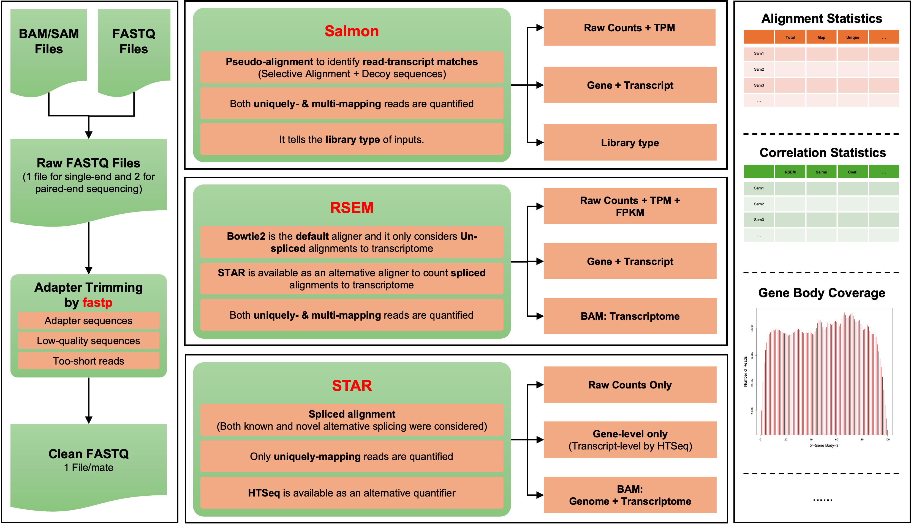
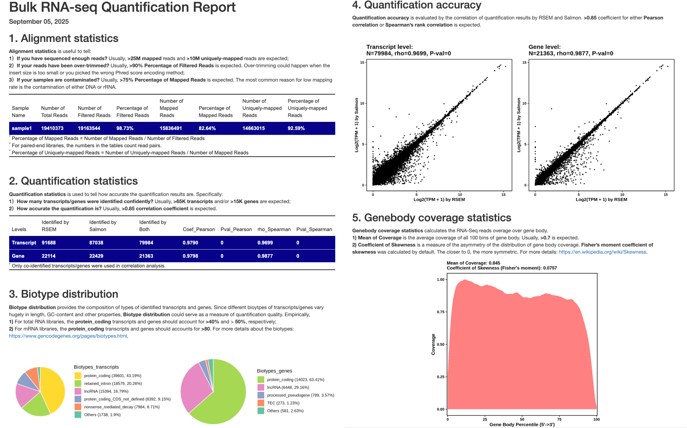
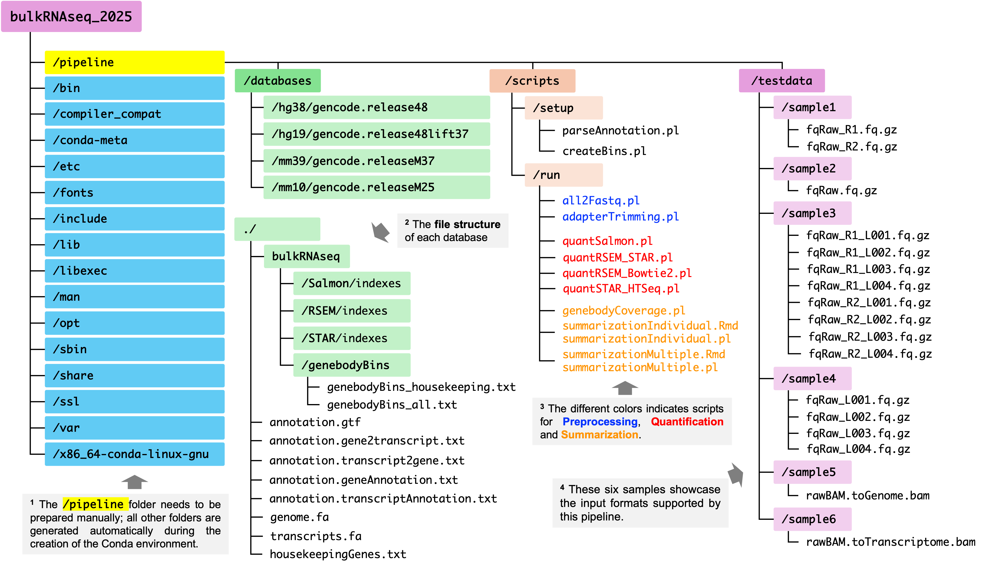
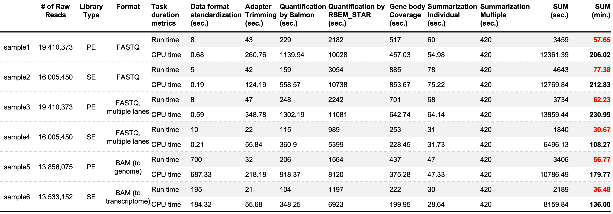
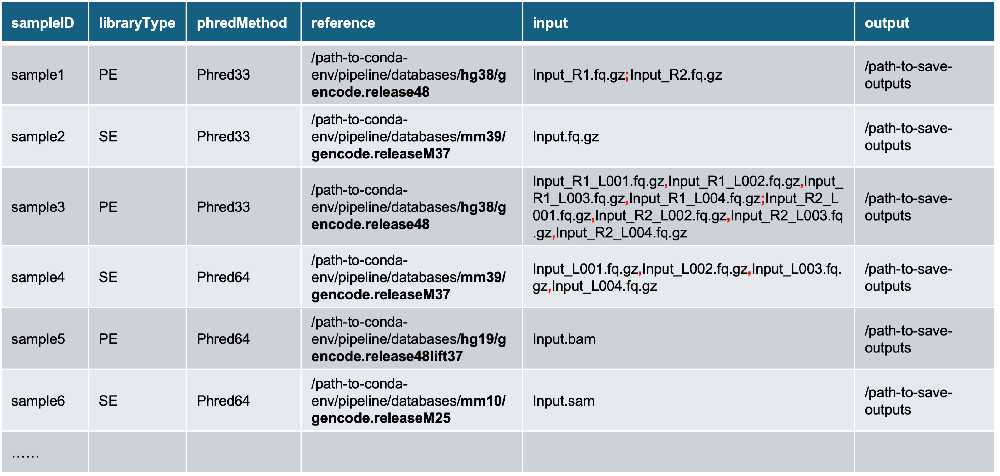

# Bulk RNA-seq Quantification Pipeline 2025

## Overview



This pipeline is designed to **accurately quantify gene and transcript abundance from bulk RNA-seq data**. By integrating both **alignment-free** and **alignment-based** methods, it enables **cross-validation** to ensure robust and reliable quantification results.

As illustrated above, the pipeline consists of three stages:

### 1. Preprocessing

The pipeline accepts raw input files in variable formats (e.g., FASTQ, BAM/SAM) and processes them to generate **standard-in-format**, **clean-in-sequence** FASTQ files. These preprocessed files are optimized for downstream quantification analysis.

### 2. Quantification

In this stage, the pipeline quantifies the abundance of both genes and transcripts. It supports three well-established and widely-used quantifiers:

- [**Salmon**](https://salmon.readthedocs.io/en/latest/salmon.html): An **alignment-free quantifier** known for its **wicked-fast speed** and **comarable accuracy**.


   - [**RSEM**](https://github.com/bli25/RSEM_tutorial): An **alignment-based quantifier** with **exceptional accuracy**. It has been used as **gold standard** in many benchmarking studies.


   - [**STAR**](https://github.com/alexdobin/STAR/blob/master/doc/STARmanual.pdf): An **alignment-based quantifier** featured by **splice-aware alignment**. This is the tool used by [GDC mRNA quantification analysis pipeline](https://docs.gdc.cancer.gov/Data/Bioinformatics_Pipelines/Expression_mRNA_Pipeline).

### 3. Summarization

The pipeline generates a comprehensive **HTML report** for each sample, detailing quantification results, alignment statistics, correlation analyses, gene body coverage visualizations, and more. For multiple samples, it produces **a unified summary report** and **a master gene expression matrix** including all samples, which can be directly utilized for downstream analyses such as [**NetBID**](https://github.com/jyyulab/NetBID).


## Key features

### **1. Accuracy ensured by cross-validation**

This pipeline quantifies the transcriptome using both **alignment-free method** (Salmon) and **alignment-based method** (RSEM_STAR). It then performs correlation analysis between the quantification results from these two approaches. A strong correlation (coefficient > 0.9) typically indicates high quantification accuracy; while samples with low correlation coefficients may require troubleshooting.

### **2. Comprehensive quality control report**

For each sample, this pipeline generates [**a comprehensive quantlity control report**](https://github.com/jyyulab/bulkRNAseq_quantification_pipeline/blob/main/testdata/summarization_individual.html), summarizing alignment statistics, quantification correlations, gene type distributions, and gene body converage metrics, and more (see example below). These metrics are invaluable for **asseesing quantification accuracy** and **troubleshooting potential issues**.



### **3. Flater, Simpler, Faster**

Every step of the pipeline has been optimized for ease of use, maintenance and speed:

- **All required tools, databases and scripts now can be set up in a single conda environment.**

  

- Time-consuming steps, such as gene body coverage analysis, has been optimized. **Now a typical run completes in about 2.5 hours**.

  

- **Only two parameters (Library Type and Phred Score Encoding Method) need to be specified manually**; all other settings, including adapter sequences and strandness, are automatically inferred.

- **The pipeline now is highly user-friendly for large-scale analyses**. Instead of relying on loops or other workarounds to process multiple samples, the pipeline now accepts **a sample table** (see example below) as standard input and automatically parse it and extract all required information. This makes it **effortless to process hundreds or thousands of samples**. 

  

## To Get Started

We have set up a conda environment for this pipeline, with all **tools**, **databases** (for hg38, hg19, mm39 and mm10) and **scripts** ready to use. You can activate it using the following commands:

```bash
module load conda3/202402 # conda version 24.1.2
conda activate /research_jude/rgs01_jude/groups/yu3grp/projects/software_JY/yu3grp/conda_env/bulkRNAseq_2025
```

- If you are unable to access the conda environment above, or if you need a reference genome assembly other than the pre-built ones (**hg38**, **hg19**, **mm39**, **mm10**), you will need to set up your own pipeline first. For detailed instructions, please refer to this tutorial: [Pipeline Setup](https://jyyulab.github.io/bulkRNAseq_quantification_pipeline/docs/1_pipeline_setup/index).

To run this pipeline,

- **If you are new to bulk RNA-seq quantification analysis**, or would like to explore the pipeline in detail, please refer to this tutorial: [Full Tutorial](https://jyyulab.github.io/bulkRNAseq_quantification_pipeline/docs/3_full_tutorial/index).

- **If you are already familiar with this pipeline**, you can quickly run it with your own samples by following this tutorial: [Quick Tutorial](https://jyyulab.github.io/bulkRNAseq_quantification_pipeline/docs/2_quick_tutorial/quick_tutorial).

 

## Contact

If you need support or have any questions about using this pipeline, please visit the **[FAQ](https://jyyulab.github.io/bulkRNAseq_quantification_pipeline/docs/4_FAQ/FAQ)** or contact us directly at **Qingfei.Pan@stjude.org**.