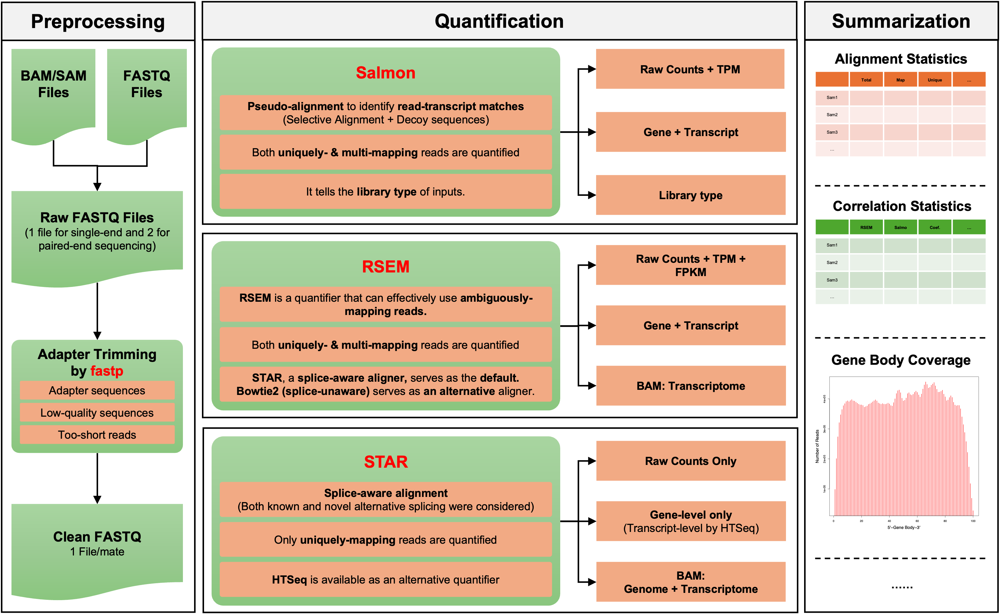

# Bulk RNA-seq Quantification Pipeline 2025

## Overview



This pipeline is designed to **accurately quantify gene and transcript abundance from bulk RNA-seq data**. By integrating both **alignment-free** and **alignment-based** methods, it enables **cross-validation** to ensure robust and reliable quantification results.

As illustrated above, the pipeline consists of three stages:

#### 1. Preprocessing ####

The pipeline accepts raw input files in variable formats (e.g., FASTQ, BAM/SAM) and processes them to generate **standard-in-format**, **clean-in-sequence** FASTQ files. These cleaned files are optimized for downstream quantification analysis.

#### 2. Quantification

In this stage, the pipeline quantifies the abundance of both genes and transcripts. It supports three well-established and widely-used quantifiers:

- [**Salmon**](https://salmon.readthedocs.io/en/latest/salmon.html): An **alignment-free quantifier** known for its **wicked-fast speed** and **comarable accuracy**.

- [**RSEM**](https://github.com/bli25/RSEM_tutorial): An **alignment-based quantifier** with **exceptional accuracy**. It has been used as **gold standard** in many benchmarking studies.

- [**STAR**](https://github.com/alexdobin/STAR/blob/master/doc/STARmanual.pdf): An **alignment-based quantifier** featured by **splice-aware alignment**. This is the tool used by [GDC mRNA quantification analysis pipeline](https://docs.gdc.cancer.gov/Data/Bioinformatics_Pipelines/Expression_mRNA_Pipeline).

#### 3. Summarization

The pipeline generates a comprehensive **HTML report** for each sample, detailing quantification results, alignment statistics, correlation analyses, gene body coverage visualizations, and more. For multiple samples, it produces **a unified summary report** and a master gene expression matrix, which can be directly utilized for downstream analyses such as [**NetBID**](https://github.com/jyyulab/NetBID).


## Key features

**Accuracy ensured by cross-validation**: This pipeline quantifies the transcriptome using both alignment-free method (Salmon) and alignment-based method (RSEM_STAR). It then performs a correlation analysis on the quantification results by these two approaches. A strong correlation (coefficient > 0.9) typically indicates high quantification accuracy.

**Comprehensive quality control report**: For each sample, this pipeline generates a comprehensive quantlity control report, summarizing alignment statistics, quantification correlations, gene type distributions, and gene body converage metrics, and more. These metrics are invaluable for asseesing quantification accuracy and troubleshooting potential issues.

**Flater, Simpler, Faste**r: Every step of the pipeline has been optimized for ease of use, maintenance and speed:

- All required tools now can be installed within one single conda environment.
- Time-consuming steps, such as gene body coverage analysis, has been optimized. Now a typical run completes in about 2.5 hours.
- There are only two arguments that the users need to specify manually. For all the rest, including the adapter sequences and strandness types, the pipeline can infer them automatically.
- All required from the user is a sample table (see example below). This make it effortless to process hundreds or thousands of samples using this pipeline. 


## To Get Started

- If you can't access to the conda environment below, or you need reference genome assembly other than hg38, hg19, mm39, mm10, you would need to set up your pipeline first. Then please refer to this tutorial: [Pipeline Setup](https://jyyulab.github.io/bulkRNAseq_quantification_pipeline/docs/1_pipeline_setup/index).

  ```bash
  module load conda3/202402
  conda activate /research_jude/rgs01_jude/groups/yu3grp/projects/software_JY/yu3grp/conda_env/bulkRNAseq_2025
  ```

- If you are new to bulk RNA-seq quantification analysis, and want to learn more details about the pipeline, please refer to this tutorial: [Full Tutorial](https://jyyulab.github.io/bulkRNAseq_quantification_pipeline/docs/3_full_tutorial/index).

- If you wann run this pipeline directly with your samples, please refer to this tutorial: [Quick Tutorial](https://jyyulab.github.io/bulkRNAseq_quantification_pipeline/docs/2_quick_tutorial/quick_tutorial).

 

## Contact

If you need support or have any questions about using this pipeline, please visit the [FAQ](https://jyyulab.github.io/bulkRNAseq_quantification_pipeline/docs/4_FAQ/FAQ) or contact us directly at Qingfei.Pan@stjude.org.